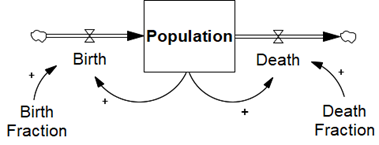
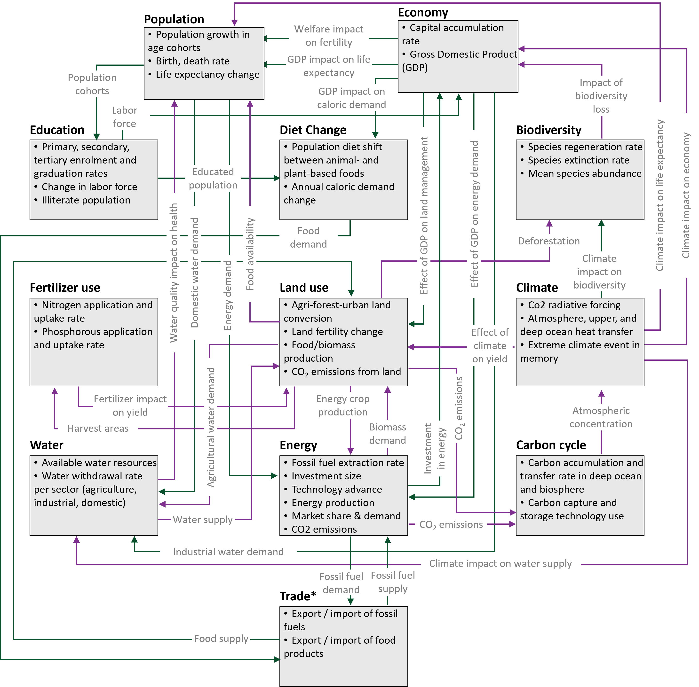

# Introduction
Full of Economic-Environment Linkages and Integration dX/dt (FeliX) 2.0 is a system dynamics-based integrated assessment model (IAM) that simulates complex interactions among global systems, including population, education, economy, energy, water, land, food, carbon cycle, climate, and biodiversity. FeliX was originally developed for projecting socio-environmental impacts in human-natural systems (Rydzak et al., 2013) and later advanced for exploring emissions pathways (Walsh et al., 2017) and evaluating sustainable diet shifts  (Eker et al., 2019). FeliX is one of the very few models that model human behavior in the human-natural systems considering comprehensive dynamic interactions of socio-economic and environmental sectors. It well addresses the main shortcoming of conventional IAMs  (neglecting feedback perspectives and nonlinear interactions among systems) and covers the breadth of social, economic, and environmental aspects (and their feedback interactions) in one integrated framework. The model operates at an annual timescale and is designed to project global-scale future socioeconomic development and environmental conditions over the long term to 2100. 

This is the full-version documentation of FeliX 2.0. This documentation stands alone as a technical documentation of FeliX, and also supports the scientific publication of FeliX.

## Basic information about System Dynamics (SD)
System dynamics (SD) is an interdisciplinary approach to understanding the dynamic behavior of complex systems over time (Meadows and Wright, 2008; Sterman, 2000). Models such as the World3 model (Meadows et al., 1972), the Integrated Sustainable Development Goals model (Millennium Institute, 2021), and the Earth4All model (Dixson-Declève et al., 2022) are all based on SD to simulate how different policies to affect human wellbeing, societies and ecosystems in the short and long-term. SD considers the interactions and feedback loops among various components to model and simulate the system's behavior (Figure 1). Feedback loops are a fundamental concept in system dynamics, representing the cause-and-effect relationships within a system. There are two types of feedback loops: reinforcing loops (marked as "+"), which amplify changes and lead to exponential growth or decline, and balancing loops (marked as "-"), which counteract changes and maintain equilibrium.

|
|:--|
|Figure 1. Interactions and feedback loops in a simple population system.|

In SD models, three key elements are commonly used: stocks, flows, and arrows (Figure 2). 
- Stocks represent accumulations or reserves within the system, such as **Population** in Figure 2. 
- Flows depict the rates of change or transfer between stocks, reflecting processes like *Birth* and *Death* in Figure 2. 
- Arrows illustrate the causal connections and feedback loops between different stocks and flows, aiding in the visualization of the system's structure and dynamics. 

By incorporating these elements, system dynamics provides a powerful tool for analyzing and improving the behavior of complex systems in diverse fields such as business, ecology, and public policy.

|
|:--|
|Figure 2. Key elements used in SD models.|

## FeliX structure and module descriptions
FeliX is a system dynamics model that simulates complex interactions among different global systems: 

1. [Population and education](1_population_education_module.md)
2. [Economy](economy-module)
3. [Energy](energy-module)
4. [Water](water-module)
5. [Land use and fertilizer use](land-fertilizer-module)
6. [Diet change](diet-module)
7. [Carbon cycle](carbon-cycle-module)
8. [Climate](climate-module)
9. [Biodiversity](biodiversity-module)

The model outcomes are determined by many interacting feedback loops within and between these systems as shown in Figure 3.

|
|:--|
|Figure 3. Overview of the FeliX model. Source: [Moallemi et al. (2022)](https://linkinghub.elsevier.com/retrieve/pii/S2590332222003244).|

## References
- Dixson-Declève, S., Gaffney, O., Ghosh, J., Randers, J., Rockström, J., Stoknes, P.E., 2022. Earth for all: a survival guide for humanity: a report to the Club of Rome (2022), fifty years after The limits to growth (1972). New Society Publishers, Gabriola Island, British Columbia, Canada.
- Eker, S., Reese, G., Obersteiner, M., 2019. Modelling the drivers of a widespread shift to sustainable diets. Nat Sustain 2, 725–735. https://doi.org/10.1038/s41893-019-0331-1
- Meadows, D.H., Meadows, D.L., Randers, J., Behrens III, W.W. (Eds.), 1972. The Limits to growth: a report for the Club of Rome’s project on the predicament of mankind. Universe Books, New York.
- Meadows, D.H., Wright, D., 2008. Thinking in systems: a primer. Chelsea Green Pub, White River Junction, Vt.
- Millennium Institute, 2021. iSDG: Documentation.
- Rydzak, F., Obersteiner, M., Kraxner, F., Fritz, S., McCallum, I., 2013. FeliX3–Impact Assessment Model: Systemic View across Societal Benefit Areas beyond Global Earth Observation. International Institute for Applied Systems Analysis (IIASA), Laxenburg.
- Sterman, J., 2000. Business dynamics: systems thinking and modeling for a complex world. Irwin/McGraw-Hill, Boston.
- Walsh, B., Ciais, P., Janssens, I.A., Peñuelas, J., Riahi, K., Rydzak, F., Van Vuuren, D.P., Obersteiner, M., 2017. Pathways for balancing CO2 emissions and sinks. Nat Commun 8, 14856. https://doi.org/10.1038/ncomms14856

[def]: _layouts/mathjax.html