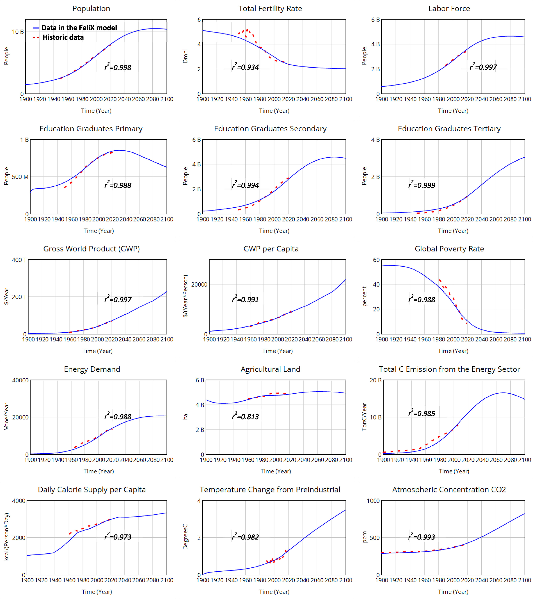
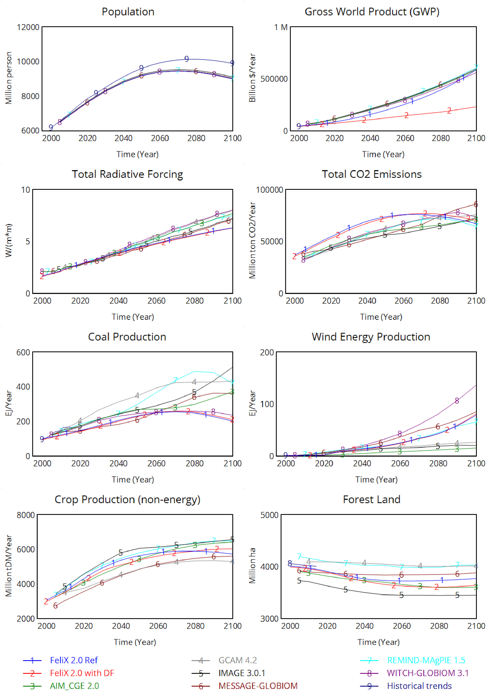

# Outputs of FeliX 

## 1. Calibration results to the historic data
Key variables from different modules in FeliX fit well to associated historic data (Figure 10.1). Fifteen key variables are selected from different modules based on the best availability of their historic data during the stimulating period of 1900‒2100 and their linkages with other variables in the whole FeliX model. The data sources of historic data include: Wittgenstein Centre Human Capital Data Explorer (Wittgenstein Centre, 2020) for population, total fertility rate, education graduates; the World Bank Data (The World Bank, 2020) for GWP, GWP per capita, and global poverty rate; International Energy Agency (IEA, 2020) for energy demand; FAOSTAT (FAOSTAT, 2020b) for agricultural land, and total daily calorie supply per capita; IPCC (2014) for total C emission from energy sector; NASA GISS (2023) for temperature change from preindustrial; and European Environment Agency (EEA, 2020) for atmospheric concentrations of $$CO_2$$.

|
|:--|
|Figure 10.1. Calibration results of key variables in FeliX. In the labels of ordinate, B stands for billions, Deg stands for degree, Dmnl stands for dimensionless, ha stands for hectare, Kcal stands for kilocalorie, Mtoe stands for million tonnes of oil equivalent, ppm stands for parts per million, T stands for trillions, and TonC stands for tonne of carbon.|

The R square ($$R^2$$) values between FeliX and historic data of these variables are more than 0.93 except of agricultural land ($$R^2$$=0.81) and temperature changes from preindustrial time ($$R^2$$=0.84). For the agricultural land, the low $$R^2$$ value is mainly because that a constant share of arable land in total agricultural land is applied to estimate total agricultural requirements. For the future improvement, we can either balance the modeled agricultural land requirements with the historic data or apply year-specific share of arable land in total agricultural land. As for temperature changes from preindustrial time, the historic data per se were modeled such as observed with ±10% range of uncertainty according to (EEA, 2020) and (IPCC 2021).  The best fitness is observed for the total population, total secondary graduates, total tertiary graduates, GWP, GWP per capita, and atmosphere $$CO_2$$ concentration. Their $$R^2$$ values are all more than 0.99. The best fitness of these variables results from relatively more available data and more detailed modeling of the related dynamic processes and feedback loops. As such, given FeliX's good reproduction of historical trends, it has been proved to be able to capture the dynamic connections and interactions of the complicated socio-economic and environmental system for simulating future development.

## 2. Future projection based on FeliX
High fitness to the historic data for key variables enables FeliX to present a more plausible future compared to existing IAM. We compare the projection results of six variables in FeliX and the results of key IAMs, namely the Global Change Assessment Model (GCAM), MESSAGE-GLOBIOM (Krey et al., 2020), WITCH-GLOBIOM (Bosetti et al., 2009, 2006), AIM_CGE (Fujimori et al., 2017), IMAGE (Bouwman et al., 2006), and REMIND-MAgPIE (Luderer et al., 2013) using the IPCC AR6 Scenario Database (Byers et al., 2022). All projections follow the Shared Socioeconomic Pathway 2 (SSP2, O’Neill et al., 2017). The comparison shows that the projection results of variables in FeliX are within the ranges of results from selected IAM models, except for the total radiative forcing. Future total radiative forcing in FeliX is lower than those in other models. This can be attributed to our assumption to use RCP4.5 projections for the non-CO2 GHGs in the baseline scenario of FeliX, in line with the current policies, while the SSP2 baseline corresponds approximately to RCP7.0. Total CO2 emissions from the energy sector before 2080 in FeliX is projected larger than those in other IAMs. Excluding carbon removal technologies such as carbon capture and storage under SSP2 is the main reason for the highest $$CO_2$$ emissions in FeliX. Coal production is relatively low while wind energy production is relatively high in FeliX compared to the production in other selected models  . It is because the market share of coal would shrink to 24% in 2100 while the share of coal in energy supply in GCAM   would be 30-50%.  In contrast, the market share of wind would expand to 12% in 2100 in FeliX. FeliX sets relatively higher market shares of renewable energy (especially wind) based on the finding in Jaxa-Rozen and Trutnevyte (2021) about underestimates in the fast development of renewables in most IAMs. Projection results of crop production and forest land in FeliX are both in line with results from other IAMs.

|
|:--|
|Figure 10.2. Future projections of key variables under the shared socioeconomic pathway 2 (SSP2) in FeliX and six existing IAMs.|

## References
- Bosetti, V., Carraro, C., Galeotti, M., Massetti, E., Tavoni, M., 2006. WITCH A World Induced Technical Change Hybrid Model. The Energy Journal 27, 13–37. http://www.jstor.org/stable/23297044
- Bosetti, V., Cian, E., Sgobbi, A., Tavoni, M., 2009. The 2008 WITCH model: new model features and baseline.
- Bouwman, A.F., Kram, T., Klein Goldewijk, K., 2006. Integrated Modelling of Global Environmental Change - An Overview of IMAGE 2.4. Netherlands Environmental Assessment Agency (MNP), Bilthoven, The Netherlands.
- Byers, E., Krey, V., Kriegler, E., Riahi, K., Schaeffer, R., Kikstra, J., Lamboll, R., Nicholls, Z., Sanstad, M., Smith, C., van der Wijst, K.-I., Khourdajie, A.A., Lecocq, F., Portugal-Pereira, J., Saheb, Y., Strømann, A., Winkler, H., Auer, C., Brutschin, E., Gidden, M., Hackstock, P., Harmsen, M., Huppmann, D., Kolp, P., Lepault, C., Lewis, J., Marangoni, G., Müller-Casseres, E., Skeie, R., Werning, M., Calvin, K., Forster, P., Guivarch, C., Hasegawa, T., Meinshausen, M., Peters, G., Rogelj, J., Samset, B., Steinberger, J., Tavoni, M., van Vuuren, D., 2022. AR6 Scenarios Database hosted by IIASA. https://doi.org/doi: 10.5281/zenodo.5886911
- EEA, 2020. Trends in atmospheric concentrations of CO2 (ppm), CH4 (ppb) and N2O (ppb), between 1800 and 2017.
- FAOSTAT, 2020. Food and land-use data. http://www.fao.org/faostat/en/#home.
- Fujimori, S., Hasegawa, T., Masui, T., 2017. AIM/CGE V2.0: Basic Feature of the Model, in: Fujimori, S., Kainuma, M., Masui, T. (Eds.), Post-2020 Climate Action. Springer Singapore, Singapore, pp. 305–328. https://doi.org/10.1007/978-981-10-3869-3_13
- IEA, 2020. The International Energy Agency (IEA) Data and Statistics. https://www.iea.org/data-and-statistics/data-sets.
- Intergovernmental Panel On Climate Change, 2021. Climate Change 2021 – The Physical Science Basis: Working Group I Contribution to the Sixth Assessment Report of the Intergovernmental Panel on Climate Change, 1st ed. Cambridge University Press. https://doi.org/10.1017/9781009157896
- IPCC (Ed.), 2014. Climate change 2014: mitigation of climate change: Working Group III contribution to the Fifth Assessment Report of the Intergovernmental Panel on Climate Change. Cambridge University Press, New York, NY.
- Jaxa-Rozen, M., Trutnevyte, E., 2021. Sources of uncertainty in long-term global scenarios of solar photovoltaic technology. Nat. Clim. Chang. 11, 266–273. https://doi.org/10.1038/s41558-021-00998-8
- Krey, V., Havlik, P., Kishimoto, P., Fricko, O., Zilliacus, J., Gidden, M., Strubegger, M., Kartasasmita, G., Ermolieva, T., Forsell, N., Guo, F., Gusti, M., Huppmann, D., Johnson, N., Kikstra, J., Kindermann, G., Kolp, P., Lovat, F., McCollum, D., Min, J., Pachauri, S., Parkinson, S., Rao, S., Rogelj, J., Ünlü, G., Valin, H., Wagner, P., Zakeri, B., Obersteiner, M., Riahi, K., 2020. MESSAGEix-GLOBIOM Documentation - 2020 release. https://doi.org/10.22022/IACC/03-2021.17115
- Luderer, G., Leimbach, M., Bauer, N., Kriegler, E., Aboumahboub, T., Curras, T.A., Baumstark, L., Bertram, C., Giannousakis, A., Hilaire, J., Klein, D., Mouratiadou, I., Pietzcker, R., Piontek, F., Roming, N., Schultes, A., Schwanitz, V.J., Strefler, J., 2013. Description of the REMIND Model (Version 1.5). SSRN Journal. https://doi.org/10.2139/ssrn.2312844
- NASA GISS, 2023. GISS Surface Temperature Analysis (GISTEMP), version 4.
- O’Neill, B.C., Kriegler, E., Ebi, K.L., Kemp-Benedict, E., Riahi, K., Rothman, D.S., Van Ruijven, B.J., Van Vuuren, D.P., Birkmann, J., Kok, K., Levy, M., Solecki, W., 2017. The roads ahead: Narratives for shared socioeconomic pathways describing world futures in the 21st century. Global Environmental Change 42, 169–180. https://doi.org/10.1016/j.gloenvcha.2015.01.004
- The World Bank, 2020. World Bank Open Data.
- Wittgenstein Centre, 2020. Wittgenstein Centre human capital data explorer. http://dataexplorer.wittgensteincentre.org/wcde-v2/.
