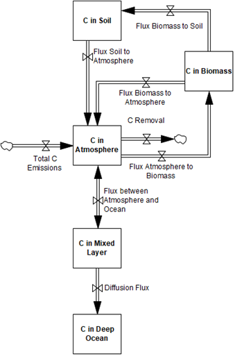

# 7. Carbon cycle
FeliX calculates CO2 emissions based on representations of carbon emissions from the energy and land-use change sectors. These emissions accumulate in the atmosphere until they are absorbed into the biosphere, pedosphere or oceans based on C-ROADS (Sterman et al., 2012, 2013).

## 7.1. Carbon emissions
Total carbon emission rates from the energy sector include carbon emission rates from fossil and renewable sources. Carbon emissions of a specified energy ($$C\_Emis\_En_{energy}$$) are based on the carbon intensity of energy production ($$C\_Int_{energy}$$), which is calibrated to historical emissions within the uncertainty ranges of the unit emissions of energy production (IPCC, 2014).

$$
C\_Emis\_En_{energy}(t) = C\_Int_{energy}(t) \times Prod_{energy}(t)
$$

(Eq. 7.1)

where $$Prod_{energy}$$ represents the annual production of different types of energy. Carbon emissions of fossil fuels also include the effect of carbon capture and storage technology.

Carbon emissions from land-use change ($$C\_Emis\_Land$$) includes emissions from agricultural land change ($$C\_Emis\_Agri$$), and forest land change due to deforestation and forest conversion to managed forests and plantations ($$C\_Emis\_Frst$$).

$$
C\_Emis\_Land(t) = 
    C\_Int\_Agri \times Land\_Chg\_Agri(t) +
    C\_Int\_Frst \times Land\_Chg\_Frst(t)
$$

(Eq. 7.2)

where $$C\_Int\_Agri$$ and $$C\_Int\_Frst$$ represent carbon intensity of agricultural land use and forest land use, respectively. $$Land\_Chg\_Agri$$ and $$Land\_Chg\_Frst$$ represent ratio of agricultural and forest land area change compared to its initial area in year 1900.

## 7.2. Carbon stock
Stocks of carbon are considered in the atmosphere, biosphere, mixed ocean layer, and four deep ocean layers (Figure 7.1). Carbon in the atmosphere ($$C\_Stk\_Atm$$) accumulates through total carbon emissions formulated above. Carbon in biosphere is captured in biomass ($$C\_Stk\_Biom$$) and soil ($$C\_Stk\_Soil$$). $$C\_Stk\_Biom$$ includes carbon stock in leaves, branches, stems and roots, whereas $$C\_Stk\_Soil$$ includes carbon stock in litter and humus. As the concentration of $$C\_Stk\_Atm$$ rises, it forces increase of the uptake by ocean and biosphere. Carbon flux from the atmosphere to the biomass is modeled according to the formula in Wullschleger et al. (1995) and grows logarithmically as the concentration of $$C\_Stk\_Atm$$ increases. The residence of $$C\_Stk\_Biom$$ depends on average lifespan. The outflow of $$C\_Stk\_Biom$$ is partitioned between carbon flux from the biomass to the atmosphere and to the humus according to humification fraction. The outflow from $$C\_Stk\_Soil$$ is equal to its content divided by its average lifespan in the humus. The flux between $$C\_Stk\_Atm$$ and carbon stock in the mixed ocean layer ($$C\_Stk\_Ocn$$) adjusts to an equilibrium that considers buffer factor, a measure of the resistance to atmospheric carbon dioxide being absorbed by the ocean surface layer. The buffer factor itself rises with the atmospheric concentration which decreases ocean absorption capacity. Deep ocean diffusion fluxes are modeled as a simple eddy-diffusion structure.

|
|:--|
|Figure 7.1. Carbon stocks and associated flux among them in FeliX.|

## References
- IPCC (Ed.), 2014. Climate change 2014: mitigation of climate change: Working Group III contribution to the Fifth Assessment Report of the Intergovernmental Panel on Climate Change. Cambridge University Press, New York, NY.
- Sterman, J., Fiddaman, T., Franck, T., Jones, A., McCauley, S., Rice, P., Sawin, E., Siegel, L., 2012. Climate interactive: the C‐ROADS climate policy model. System Dynamics Review 28, 295–305. https://doi.org/10.1002/sdr.1474
- Sterman, J.D., Fiddaman, T., Franck, T., Jones, A., McCauley, S., Rice, P., Sawin, E., Siegel, L., 2013. Management flight simulators to support climate negotiations. Environmental Modelling & Software 44, 122–135. https://doi.org/10.1016/j.envsoft.2012.06.004
- Wullschleger, S.D., Post, W.M., King, A.W., 1995. On the Potential for a CO2 Fertilization Effect in Forests: Estimates of the Biotic Growth Factor Based on 58 Controlled-Exposure Studies, in: Woodwell, G.M., Mackenzie, F.T. (Eds.), Biotic Feedbacks in the Global Climatic System. Oxford University PressNew York, NY, pp. 85–107. https://doi.org/10.1093/oso/9780195086409.003.0005
