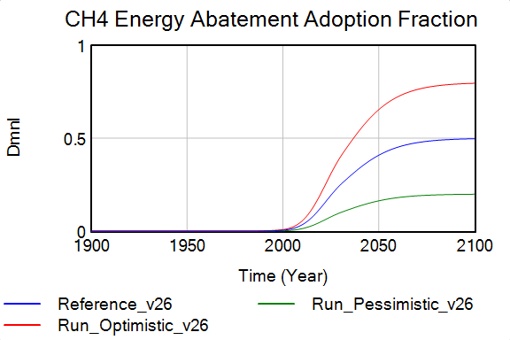

# 9. Emissions
FeliX models emissions of three major greenhouse gases: CO₂, CH₄, and N₂O. These emissions originate from four main sectors: (1) Agriculture, (2) LULUCF (Land Use, Land-Use Change, and Forestry), (3) Energy, and (4) Industry & Waste.

FeliX uses an **activity-based emission accounting approach** as described in Equation 9.1. It estimates emissions indirectly from activities and outputs across different sectors through emission factors. Emission factors ($EF^{Gas}_{Activity}$) are determined in this order of priorities: (1) IPCC default values, (2) Historical data calculations, (3) Model calibration.

A dynamic abatement factor is included in the emission calculations to account for technological improvements that FeliX does not explicitly model. Since CH₄ and N₂O abatement technologies in Energy, Agriculture, Industry, and Waste sectors are expected to play a significant role in future emission trajectories, a logistic function is used to represent their gradual adoption over time. More details about this will be described in Section 9.5.

$$
Emis_{Activity}^{Gas}(t) = Activity(t)\times EF^{Gas}_{Activity}\times Abatement^{Gas}_{Activity}(t), 
\quad Gas \in \{CO_2,CH_4, N_2O\}     
\quad \text{(Eq. 9.1)}
$$

The key activities contributing to the various emissions are described in Table 9.1. Categories of activities from Agriculture, LULUCF and Industry & Waste are based on FAOSTAT (2025), while Energy sector activities follow IEA (2025) guidelines. Emissions for individual activities are likewise calibrated from these sources, while aggregated emissions for each gas are calibrated using data from the RCMIP protocol (Nicholls et al., 2019).

Table 9.1: Sector, Activity, and Greenhouse Gas Emission Contributions.
| **Sector**         | **Activity**              | **CO₂** | **CH₄** | **N₂O** | **Equation** |
|--------------------|---------------------------|:------:|:------:|:------:|:------:|
| **Agriculture**    | Livestock & Manure        |        | 🟢     | 🔵     | 9.2    |
|                    | Rice Cultivation          |        | 🟢     |        | 9.3    |
|                    | Crop Residue Burning      |        | 🟢     | 🔵     | 9.4    |
|                    | Agricultural Soils        |        |        | 🔵     | 9.5    |
| **LULUCF**         | Burning Biomass           | 🔴     | 🟢     | 🔵     | 9.6    |
|                    | Net Forest Conversion     | 🔴     |        |        | 9.7    |
|                    | Forestland                | 🔴     |        |        | 9.8    |
|                    | Drained Organic Soils     | 🔴     |        |        | 9.9    |
| **Energy**         | Oil Production            | 🔴     | 🟢     | 🔵     | 9.10-12  |
|                    | Coal Production           | 🔴     | 🟢     | 🔵     | 9.10-12  |
|                    | Gas Production            | 🔴     | 🟢     | 🔵     | 9.10-12  |
|                    | Biomass Production        | 🔴     | 🟢     | 🔵     | 9.10-12  |
|                    | Solar Production          | 🔴     |        |        | 9.10-12   |
|                    | Wind Production           | 🔴     |        |        | 9.10-12   |
| **Industry & Waste** | Waste Disposal          |        | 🟢     |        | 9.13   |
|                    | Industrial Activity       |        |        | 🔵     | 9.14   |

<!-- Agricultural and LULUCF Activities utilize variables from the [Land Use Module](1_1_5_land_use_and_fertilizer_use.md)-->

## 9.1 Agriculture Emissions 
<!--Sector-->
Agriculture activities contribute primarily to $CH_4$ and $N_2O$ emissions. FeliX quantifies agricultural emissions are based on production rate of various food items (see [Land Use and Fertilizer Use Module](1_1_5_land_use_and_fertilizer_use.md)). Even the emission formula from agricultural soils ($Emis_{AgricultureSoils}^{N2O}$) which are based on IPCC (2006a) guidelines, are derived from nitrogen flows ($N$), which themselves are calculated using the production rates of animal-based food.

$$
Emis_{LivestockManure}^{Gas}(t) = \sum_{AnimalFood} Prod_{AnimalFood}(t) \times EF^{Gas}_{LivestockManure} \times \frac{1}{Yield(t)} \times Abatement^{Gas}_{Agriculture}(t), 
\quad Gas \in \{CH_4, N_2O\}
\quad \text{(Eq. 9.2)}
$$

$$
Emis_{RiceCultivation}^{CH4}(t) = Prod_{Grains}(t) \times Grains\_to\_Rice\_Ratio \times EF_{RiceCultivation}^{CH_4} \times Abatement^{CH_4}_{Agriculture}(t)
\quad \text{(Eq. 9.3)}
$$

$$
Emis_{CropBurning}^{Gas}(t) = \sum_{PlantFood}Prod_{PlantFood}(t) \times Residue\_to\_Production \times EF^{Gas}_{CropBurning}, 
\quad Gas \in \{CH_4, N_2O\}
\quad \text{(Eq. 9.4)}
$$

$$
Emis_{AgricultureSoils}^{N2O}(t) =
\left(N_{Commercial}(t) \times EF_{Direct} +
N_{Manure}(t) \times EF_{Volatilization} +
N_{Leaching}(t) \times EF_{Leaching}\right) \times Abatement^{N_2O}_{Agriculture}(t)
\quad \text{(Eq. 9.5)}
$$

where emission factors $EF^{Gas}_{LivestockManure}$, $EF^{Gas}_{RiceCultivation}$, and $EF^{Gas}_{CropBurning}$ were calculated from historical data in FAOSTAT based on the same relationship. For $EF^{Gas}_{LivestockManure}$, where the relationship between production and emissions was not linear due to productivity changes, an adjustment factor ($\frac{1}{Yield(t)}$) was introduced since emissions tend to be tied to animal heads rather than production rate (Dong et al., 2009).

## 9.2 LULUCF Emissions
Land Use, Land Use Change and Forestry (LULUCF) activities contribute primarily to $CO_2$ emissions, with minor contributions to $N_2O$ and $CH_4$ from biomass burning. FeliX quantifies LULUCF emissions based largely on forest land changes and agricultural land changes relative to initial year 1900 stocks ($\frac{ForestLand(t)}{Init\_ForestLand}$ and $\frac{AgriLand(t)}{Init\_AgriLand}$ respectively). See [Land Use and Fertilizer Use Module](1_1_5_land_use_and_fertilizer_use.md) for details on the drivers of land use changes.

$$
Emis_{NetForest}^{CO2}(t) = \frac{ForestLand(t)}{Init\_ForestLand} \times EF^{CO2}_{NetForest}, 
\quad \text{(Eq. 9.6)}
$$

$$
Emis_{ForestLand}^{CO2}(t) = ForestLand(t) \times EF^{CO2}_{ForestLand}, 
\quad \text{(Eq. 9.7)}
$$

$$
Emis_{BurningBiomass}^{Gas}(t) = \frac{AgriLand(t)}{Init\_AgriLand} \times Burnt Fraction \times EF^{Gas}_{BurningBiomass}, 
\quad Gas \in \{CO_2, CH_4, N_2O\}
\quad \text{(Eq. 9.8)}
$$

$$
Emis_{DrainedSoils}^{Gas}(t) = \frac{AgriLand(t)}{Init\_AgriLand} \times EF^{Gas}_{DrainedSoils}, 
\quad Gas \in \{CO_2, CH_4, N_2O\}
\quad \text{(Eq. 9.9)}
$$

where all emission factors $EF^{CO2}_{NetForest}$, $EF^{CO2}_{ForestLand}$, $EF^{Gas}_{BurningBiomass}$ and $EF^{Gas}_{DrainedSoils}$ were all calibrated within the model using FAOSTAT (2025b) emission data.

## 9.3 Energy Emissions
Energy emissions contribute primarily to $CO_2$ emissions, with smaller contributions to $CH_4$ and $N_2O$. $CO_2$ is released from widespread fuel burning for electricity, heat, and transportation; $CH_4$ is emitted mostly from natural gas systems and coal mining; and $N_2O$ arises from certain combustion processes for fossil fuels. The energy sector supports various end uses, including industrial activities, agricultural production, residential and commercial energy use, and transportation.

Emissions from the energy sector are based solely on the annual production rates of different fossil and renewable energy sources ($Prod_{Energy}$ in [Energy Module](1_1_3_energy.md)), including oil, coal, gas, biomass, solar, and wind. Carbon emissions from fossil fuels also include the effect of carbon capture and storage technology.

$$
Emis_{Energy}^{CO_2}(t) = \sum_{Energy} Prod_{Energy}(t) \times EF_{Energy}^{CO_2}, 
\quad Energy \in \{Oil, Coal, Gas, Biomass, Solar, Wind\} \quad \text{(Eq. 9.10)}
$$

$$
Emis_{Energy}^{CH_4}(t) = \sum_{Energy} Prod_{Energy}(t) \times EF_{Energy}^{CH_4} \times Abatement^{CH_4}_{Energy}(t), 
\quad Energy \in \{Oil, Coal, Gas, Biomass\}
\quad \text{(Eq. 9.11)}
$$

$$
Emis_{Energy}^{N_2O}(t) = \sum_{Energy} Prod_{Energy}(t) \times EF_{Energy}^{N_2O}, 
\quad Energy \in \{Oil, Coal, Gas\}
\quad \text{(Eq. 9.12)}
$$

where emission factors $EF_{Energy}^{CO_2}$, $EF_{Energy}^{CH_4}$, $EF_{Energy}^{N_2O}$ are calibrated to historical emissions within the uncertainty ranges of the unit emissions of energy production (IPCC, 2014).

## 9.4 Industry and Waste Emissions
<!--Sector-->

<!--Formula Explanation-->
In FeliX, emissions from Industry and Waste are modeled directly and indirectly through their relationship with Gross World Product (see $GWP$ in [Economy Module](1_1_2_economy.md)).

**CH₄ from Waste** emissions are calculated using the Municipal Solid Waste (MSW) disposal rate, which is estimated from GWP using the IPCC (2000) formulation:
$$
Emission_{Waste}^{CH_4}(t) = MSW(GWP)(t) \times EF_{Waste}^{CH_4} \times Abatement^{CH_4}_{Waste}(t)
\quad \text{(Eq. 9.13)}
$$
where MSW is derived from a linear regression with GWP (gradient = 0.027, constant = 0.5695). The emission factor $EF_{Waste}^{CH_4}$ is calibrated within IPCC default uncertainty ranges, using a weighted average of different waste disposal site conditions. This is calibrated with historical data from the RCMIP (2020).

**N₂O from Industry** emissions are calculated as:
$$
Emission_{Industrial}^{N_2O}(t) = GWP(t) \times EF_{Industrial}^{N_2O} \times Abatement^{N_2O}_{Industry}(t)
\quad \text{(Eq. 9.14)}
$$
where $EF_{Industrial}^{N_2O}$ represents the industrial emission factor in metric tons of N₂O per dollar of GWP. This is calibrated with historical data from RCMIP (2020).

## 9.5 Abatement Fractions
<figure>
    

        
        
    

    <figcaption style="text-align:center; margin-top:6px;">
        Figure 9.1. (Upper) CH₄ energy abatement adoption fractions across SSP scenarios (Ref=SSP2, Optimistic=SSP1, Pessimistic=SSP3). The observed differences is caused by the different maximum abatable fraction. (Lower) Resultant CH₄ waste and fossil industrial emissions after abatement, is reasonably consistent with other IAM trajectories.
    </figcaption>
</figure>

Abatement factors account for technological improvements in emission reduction that FeliX does not explicitly model. Each abatement factor is a dimensionless value between 0 and 1, representing the fraction of baseline emissions that has been eliminated through technological advancement. For instance, an abatement factor of 0.8 indicates that 80% of baseline emissions have been abated, leaving only 20% of original emissions. 

In FeliX, abatement factors are applied to the following emission sources:
- **CH₄ from Energy** – methane emissions from fossil fuel production and combustion
- **CH₄ from Agriculture** – methane emissions from livestock, manure, and rice cultivation
- **CH₄ from Waste** – methane emissions from waste disposal
- **N₂O from Agriculture** – nitrous oxide emissions from agricultural soils and crop burning
- **N₂O from Industry** – nitrous oxide emissions from industrial processes

The adoption of these technologies is represented using a logistic function, consistent with well-established models of technology adoption and diffusion and aligned with historical patterns documented in the literature (Wilson, 2012). It captures the trend in which deployment starts slowly, speeds up as technologies scale, and then slows again as they reach their maximum potential.

The key parameters of this function are: $MaxFrac^{Gas}_{Activity}$, the maximum percentage of emissions that can be reduced; $MidYear^{Gas}_{Activity}$, the year when adoption reaches halfway to its maximum; and $Slope^{Gas}_{Activity}$, the steepness of the S-curve. SSP–RCP scenarios vary only the $MaxFrac^{Gas}_{Activity}$ and all other parameters are held constant.

$$
Abatement^{Gas}_{Activity}(t) = 1 - 
\frac{MaxFrac^{Gas}_{Activity}}
{1 + \exp\!\left[-Slope^{Gas}_{Activity}(t)\,\big(t - MidYear^{Gas}_{Activity}\big)\right]}
\quad \text{(Eq. 9.15)}
$$

Unlike a standard logistic function with constant steepness, FeliX uses a **time-varying slope** that decreases over time (Eq. 9.16). This formula captures observed patterns in technological transitions, in which the upscaling and growth phases (i.e later stages) can speed up or slow down as deployment progresses. Representing this behaviour through a changing slope allows the model to reflect these shifts in momentum toward the final phases of adoption (illustrated in Figure 9.1). This is formulated with a $Ramp$ function which decreases the slope linearly over time. 

$$
Slope^{Gas}_{Activity}(t) =
Slope^{Gas}_{Activity}(0) - Ramp(Gradient, t_{start}, t_{end})
\quad \text{(Eq. 9.16)}
$$

## References
- Dong, H., Mangino, J., McAllister, T.A., 2009. Emissions from Livestock and Manure Management. In: IPCC Guidelines for National Greenhouse Gas Inventories, Volume 4: Agriculture, Forestry and Other Land Use. IGES, Japan.
- FAOSTAT, 2025b. FAOSTAT Emissions Total. https://www.fao.org/faostat/en/#data/GT.
- IEA, 2025. Data and Statistics. https://www.iea.org/data-and-statistics/data-sets.
- IPCC, 2000. Good Practice Guidance and Uncertainty Management in National Greenhouse Gas Inventories: CH4 Emissions from Solid Waste Disposal. IPCC/OECD/IEA/IGES, Hayama, Japan.
- IPCC, 2006a. Guidelines for National Greenhouse Gas Inventories, Volume 4: Agriculture, Forestry and Other Land Use, Chapter 11: N2O Emissions from Managed Soils, and CO2 Emissions from Lime and Urea Application. IGES, Japan.
- IPCC, 2006b. Guidelines for National Greenhouse Gas Inventories, Volume 4: Agriculture, Forestry and Other Land Use, Chapter 10: Emissions from Livestock and Manure Management. IGES, Japan.
- IPCC, 2014. Climate Change 2014: Mitigation of Climate Change. Contribution of Working Group III to the Fifth Assessment Report. Cambridge University Press, Cambridge, UK.
- Nicholls, Z. R. J., Meinshausen, M., Lewis, J., Gieseke, R., Dommenget, D., Dorheim, K., Fan, C.-S., Fuglestvedt, J. S., Gasser, T., Golüke, U., Goodwin, P., Hartin, C., Hope, A. P., Kriegler, E., Leach, N. J., Marchegiani, D., McBride, L. A., Quilcaille, Y., Rogelj, J., Salawitch, R. J., Samset, B. H., Sandstad, M., Shiklomanov, A. N., Skeie, R. B., Smith, C. J., Smith, S., Tanaka, K., Tsutsui, J., and Xie, Z., 2020. Reduced Complexity Model Intercomparison Project Phase 1: introduction and evaluation of global-mean temperature response. Geosci. Model Dev., 13, 5175–5190. https://doi.org/10.5194/gmd-13-5175-2020
- Wilson, C., 2012. Up-scaling, formative phases, and learning in the historical diffusion of energy technologies. Energy Policy, 50, 81-94. https://doi.org/10.1016/j.enpol.2012.04.077.
<!--
$$
CO2_{total}(t) =
    CO2_{LULUCF}(t) +
    CO2_{Energy}(t)
    \quad \text{(Eq. 1)}
$$

$$
CH4_{total}(t) =
    CH4_{Agri}(t) +
    CH4_{LULUCF}(t) +
    CH4_{Energy}(t) +
    CH4_{IndWaste}(t)
    \quad \text{(Eq. 2)}
$$

$$
N2O_{total}(t) =
    N2O_{Agri}(t) +
    N2O_{LULUCF}(t) +
    N2O_{Energy}(t) +
    N2O_{IndWaste}(t)
    \quad \text{(Eq. 3)}
$$

