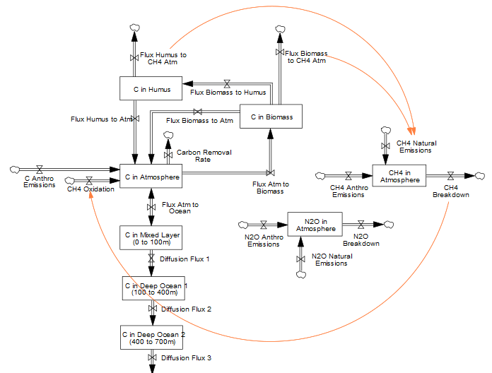

# B. Gaseous cycle
FeliX models the atmospheric cycles of three major greenhouse gases: $CO_2$, $CH_4$, and $N_2O$. These gases accumulate in the atmosphere through emissions from various sectors (detailed in the [Emissions Module](1_1_A_emissions.md)). The atmospheric concentrations are calculated by converting their respective stocks ($C\_Stk_{Atm}$, $CH4\_Stk_{Atm}$, and $N2O\_Stk_{Atm}$) from mass units (tons) to volume mixing ratios (ppm or ppb), using their molar masses and the total number of moles in the atmosphere.

|
|:--|
|Figure B.1. Stocks and associated flux for major greenhouse gases (i.e. $CO_2$, $CH_4$, $N_2O$) in FeliX.|

$CO_2$ is modeled explicitly through exchanges with the atmosphere, biosphere, soil, and ocean on C-ROADS (Sterman et al., 2012, 2013), while $CH_4$ and $N_2O$ are represented as first order impulse-response with single atmospheric stocks with chemical lifetimes adapted from FaIRv2.0.0 (Leach et al., 2021).

The cycles of these gases are also interconnected in the atmosphere. Orange arrows in Figure B.1 indicate key interactions: carbon fluxes from soil and biomass generate natural $CH_4$ emissions, linking the $CO_2$ and $CH_4$ cycles. Furthermore, the breakdown of $CH_4$ in the atmosphere produces carbon compounds, creating a feedback into the carbon cycle. 

## B.1. Carbon Cycle (CO₂/C)

Stocks of carbon are considered in the atmosphere, biosphere, mixed ocean layer, and four deep ocean layers (Figure B.1). Carbon in the atmosphere ($C\_Stk_{Atm}$) accumulates through total carbon emissions formulated above. Carbon in the biosphere is captured in biomass ($C\_Stk_{Biom}$) and soil ($C\_Stk_{Soil}$). $C\_Stk_{Biom}$ includes carbon stock in leaves, branches, stems, and roots, whereas $C\_Stk_{Soil}$ includes carbon stock in litter and humus. As the concentration of $C\_Stk_{Atm}$ rises, it forces an increase of the uptake by ocean and biosphere. Carbon flux from the atmosphere to the biomass is modeled according to the formula in Wullschleger et al. (1995) and grows logarithmically as the concentration of $C\_Stk_{Atm}$ increases. The residence of $C\_Stk_{Biom}$ depends on average lifespan. The outflow of $C\_Stk_{Biom}$ is partitioned between carbon flux from the biomass to the atmosphere and to the humus according to humification fraction. The outflow from $C\_Stk_{Soil}$ is equal to its content divided by its average lifespan in the humus. The flux between $C\_Stk_{Atm}$ and carbon stock in the mixed ocean layer ($C\_Stk_{Ocn}$) adjusts to an equilibrium that considers buffer factor, a measure of the resistance to atmospheric carbon dioxide being absorbed by the ocean surface layer. The buffer factor itself rises with the atmospheric concentration which decreases ocean absorption capacity. Deep ocean diffusion fluxes are modeled as a simple eddy-diffusion structure.

## B.2. Methane Cycle (CH$_4$)

Methane ($CH_4$) is modeled as a first-order impulse-response system with a single atmospheric stock. The system includes inflows from natural and anthropogenic emissions, while outflows occur through atmospheric breakdown with a chemical lifetime ($\tau_{CH_4} \approx 12$ years). 

**Atmospheric Methane Stock:**
$$
CH4\_Stk_{Atm}(t+1) =
    CH4\_Stk_{Atm}(t) + 
    Emis^{CH4}_{Anthropogenic}(t) +
    Emis^{CH4}_{Natural}(t) -
    CH4\_Emis(t) -
    \frac{CH4\_Stk_{Atm}(t)}{\tau_{CH_4}(t)}
    \quad \text{(Eq. B.1)}
$$

**Natural Methane Emissions:**
$$
Emis^{CH4}_{Natural}(t) = (C\_Flux_{Biom→CH4Atm} + C\_Flux_{Soil→CH4Atm}) \times Effect(TempChange(t))
\quad \text{(Eq. B.2)}
$$
where $Effect(TempChange(t))$ represents the impact of temperature change on biological CH$_4$ release.

**Methane Lifetime Dynamics:**
$$
\tau_{CH_4}(t) = \tau_0 \times Effect(TempChange(t)) \times Effect(\frac{N(t)}{N_0}, \frac{M(t)}{M_0})
\quad \text{(Eq. B.3)}
$$
where $\tau_0$ is the baseline lifetime, $Effect(TempChange(t))$ is the temperature-dependent scaling factor, and $Effect(\frac{N(t)}{N_0}, \frac{M(t)}{M_0})$ accounts for the influence of atmospheric N$_2$O and CH$_4$ concentrations. Formula is inspired by the FaIR Model (Leach et al., 2021) and calibrated in FeliX.

## B.3. Nitrous Oxide Cycle (N₂O)

Nitrous oxide ($N_2O$) is modeled as a first-order impulse-response system with a single atmospheric stock. The system includes inflows from natural and anthropogenic emissions, while outflows occur through stratospheric reactions with a chemical lifetime ($\tau_{N_2O} \approx 114$ years).

**Atmospheric Nitrous Oxide Stock:**
$$
N2O\_Stk_{Atm}(t+1) =
    N2O\_Stk_{Atm}(t) +
    Emis^{N2O}_{Anthropogenic}(t) +
    Emis^{N2O}_{Natural}(t)-
    \frac{N2O\_Stk_{Atm}(t)}{\tau_{N_2O}(t)}
    \quad \text{(Eq. B.4)}
$$

**Natural Nitrous Oxide Emissions:**
$$
Emis^{N2O}_{Natural}(t) = Emis_0 \times Effect(TempChange(t))
\quad \text{(Eq. B.5)}
$$
where $Effect(TempChange(t))$ represents the impact of temperature change on biological N₂O release.

**Nitrous Oxide Lifetime Dynamics:**
$$
\tau_{N_2O}(t) = \tau_0 \times Effect(N2O\_Stk(t))
\quad \text{(Eq. B.6)}
$$
where $\tau_0$ is the baseline lifetime, and $Effect(N2O\_Stk(t))$ is a scaling factor that grows exponentially with atmospheric N₂O concentration. Formula is adapted from the FaIR model (Leach et al., 2021) and calibrated in FeliX.

## References
- IPCC (Ed.), 2014. Climate change 2014: mitigation of climate change: Working Group III contribution to the Fifth Assessment Report of the Intergovernmental Panel on Climate Change. Cambridge University Press, New York, NY.
- Leach, N.J., Jenkins, S., Nicholls, Z., Smith, C.J., Lynch, J., Cain, M., Walsh, T., Wu, B., Tsutsui, J., Allen, M.R., 2021. FaIRv2.0.0: a generalized impulse response model for climate uncertainty and future scenario exploration. Geoscientific Model Development 14, 3007–3036. https://doi.org/10.5194/gmd-14-3007-2021
- Sterman, J., Fiddaman, T., Franck, T., Jones, A., McCauley, S., Rice, P., Sawin, E., Siegel, L., 2012. Climate interactive: the C‐ROADS climate policy model. System Dynamics Review 28, 295–305. https://doi.org/10.1002/sdr.1474
- Sterman, J.D., Fiddaman, T., Franck, T., Jones, A., McCauley, S., Rice, P., Sawin, E., Siegel, L., 2013. Management flight simulators to support climate negotiations. Environmental Modelling & Software 44, 122–135. https://doi.org/10.1016/j.envsoft.2012.06.004
- Wullschleger, S.D., Post, W.M., King, A.W., 1995. On the Potential for a CO2 Fertilization Effect in Forests: Estimates of the Biotic Growth Factor Based on 58 Controlled-Exposure Studies, in: Woodwell, G.M., Mackenzie, F.T. (Eds.), Biotic Feedbacks in the Global Climatic System. Oxford University PressNew York, NY, pp. 85–107. https://doi.org/10.1093/oso/9780195086409.003.0005
