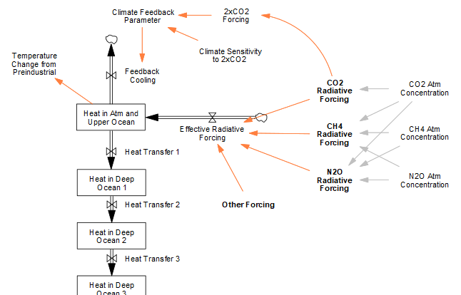

# C. Climate
The climate module in FeliX is based on the C-ROADS model (Sterman et al., 2012), which in turn refers to FREE model (Fiddaman, 2002) and DICE model (Nordhaus, 1994, 1992). The Earth's radiation budget is constrained to the temperature change due to carbon dioxide ($CO_2$), methane ($CH_4$), nitrous oxide ($N_2O$), halocarbons and other forcings (e.g., aerosols, $O_3$, etc.). 

|
|:--|
|Figure C.1. Energy Balance Model. Heat is exchanged among the atmosphere and upper ocean and four deep ocean layers. The figure illustrates the different heat fluxes that drive the climate system in this model.

The temperature change in the model is driven by three main mechanisms: radiative forcings from greenhouse gases, feedback cooling from outbound longwave radiation, and heat transfer between atmospheric-upper ocean and deep ocean layers. The temperature change ($TempChange$) is calculated as the ratio of current heat content in the atmosphere and upper ocean ($Heat_{AtmUpperOcn}$) to their combined heat capacity:

$$
TempChange = \frac{Heat_{AtmUpperOcn}}{HeatCapacity_{AtmUpperOcn}}
\quad \text{(Eq. C.1)}
$$

## C.1 Radiative Forcing

In FeliX, temperature change is driven by forcings from $CO_2$, $CH_4$, and $N_2O$, computed based on atmospheric concentrations as described in [B. Gaseous cycles](1_1_B_gaseous_cycles.md). These three gases accounts for approximately 87% of total anthropogenic effective radiative forcing as of 2019, according to IPCC AR6 (Forster et al., 2021). The remaining forcings are generated exogenously based on historical data and the future projections from Representative Concentration Pathways (RCPs) (Byers et al., 2022).

**Total effective radiative forcing ($RF_{gas}$)** is the sum of the contributions from $CO_2$, $CH_4$, and $N_2O$ and other climate drivers:

$$
RF_{Total}(t) = RF_{CO2}(t) + RF_{CH4}(t) + RF_{N2O}(t) + RF_{Others}(t) \quad \text{(Eq. C.2)}
$$

**CO₂, N₂O, and CH₄ forcings**: The radiative forcing of each of these gases is calculated based on their atmospheric concentrations, as determined by the gaseous cycles module. The formulas are adapted from Meinshausen et al. (2020), which accounts for overlapping effects among the gases:

$$
RF_{CO2}(t) = (a' + C_1 \sqrt{N(t)}) \cdot \ln\frac{C(t)}{C_0}
\quad \text{(Eq. C.3)}
$$

$$
RF_{N2O}(t) = \left(a_2 \sqrt{C(t)} + b_2 \sqrt{N(t)} + c_2 \sqrt{M(t)} + d_2 \right) \cdot \left(\sqrt{N(t)} - \sqrt{N_0}\right)
\quad \text{(Eq. C.4)}
$$

$$
RF_{CH4}(t) = \left(a_3 \sqrt{M(t)} + b_3 \cdot (\sqrt{N(t)} + d_3)\right) \cdot \left(\sqrt{M(t)} - \sqrt{M_0}\right)
\quad \text{(Eq. C.5)}
$$

where:  
- $C(t), N(t), M(t)$ are the atmospheric concentrations of CO₂, N₂O, and CH₄ at time $t$, and $C_0, N_0, M_0$ are their pre-industrial values.  
- $a', a_2, b_2, c_2, d_2, a_3, b_3, d_3$ are coefficients which can be found in Meinshausen et al. (2020) ([see Table 3](https://gmd.copernicus.org/articles/13/3571/2020/gmd-13-3571-2020-t03-web.png))

**Other forcings:** Forcings from halocarbons, aerosols, ozone, and other climate drivers are applied exogenously based on RCP projections. This formulation ensures that radiative forcing responds dynamically to the emissions of the primary greenhouse gases while maintaining consistency with established climate projections for secondary forcing agents.

## C.2 Feedback cooling
Feedback cooling due to outbound longwave radiation governs feedback mechanism of the atmosphere and the upper ocean. The rate of cooling is determined by the climate sensitivity—a metric used to characterize the response of the global climate system to a given forcing. It is broadly defined as the equilibrium global mean surface temperature change following a doubling of atmospheric $CO_2$. This is estimated as 3°C based on IPCC AR4 (Hegerl et al., 2007).

## C.3 Heat transfer
The Energy Balance Model in FeliX tracks heat stocks between the atmosphere, the upper ocean, and four layers of the deep ocean. Heat transfer into the deeper ocean layers is modeled as a function of eddy diffusion, which also governs the movement of carbon through the deep ocean. FeliX represents four distinct deep-ocean layers: 100–200 m, 200–700 m, 700–2000 m, and 2000+ m.

## References
- Byers, E., Krey, V., Kriegler, E., Riahi, K., Schaeffer, R., Kikstra, J., Lamboll, R., Nicholls, Z., Sanstad, M., Smith, C., van der Wijst, K.-I., Khourdajie, A.A., Lecocq, F., Portugal-Pereira, J., Saheb, Y., Strømann, A., Winkler, H., Auer, C., Brutschin, E., Gidden, M., Hackstock, P., Harmsen, M., Huppmann, D., Kolp, P., Lepault, C., Lewis, J., Marangoni, G., Müller-Casseres, E., Skeie, R., Werning, M., Calvin, K., Forster, P., Guivarch, C., Hasegawa, T., Meinshausen, M., Peters, G., Rogelj, J., Samset, B., Steinberger, J., Tavoni, M., van Vuuren, D., 2022. AR6 Scenarios Database hosted by IIASA. https://doi.org/doi: 10.5281/zenodo.5886911
- Fiddaman, T.S., 2002. Exploring policy options with a behavioral climate–economy model. System Dynamics Review 18, 243–267. https://doi.org/10.1002/sdr.241
- Hegerl, G.C., Zwiers, F.W., Braconnot, P., Gillett, N.P., Luo, Y., Orsini, J.A.M., Nicholls, N., Penner, J.E., Stott, P.A., Allen, M. and Ammann, C., 2007. Understanding and attributing climate change. Contribution of Working Group I to the Fourth Assessment Report of the Intergovernmental Panel on Climate Change (IPCC), Solomon, S., D. Qin, M. Manning, Z. Chen, M. Marquis, KB Averyt, M. Tignor and HL Miller (eds.). Cambridge University Press, Cambridge, United Kingdom and New York, NY, USA, 996 pp.
- Meinshausen, M., Nicholls, Z. R. J., Lewis, J., Gidden, M. J., Vogel, E., Freund, M., Beyerle, U., Gessner, C., Nauels, A., Bauer, N., Canadell, J. G., Daniel, J. S., John, A., Krummel, P. B., Luderer, G., Meinshausen, N., Montzka, S. A., Rayner, P. J., Reimann, S., Smith, S. J., van den Berg, M., Velders, G. J. M., Vollmer, M. K., Wang, R. H. J., 2020. The shared socio-economic pathway (SSP) greenhouse gas concentrations and their extensions to 2500. Geosci. Model Dev. 13, 3571–3605. https://doi.org/10.5194/gmd-13-3571-2020
- Nordhaus, W.D., 1994. Managing the global commons. The Economics of Climate Change. MA: MIT Press.
- Nordhaus, W.D., 1992. The ”Dice“ Model: Background and Structure of a Dynamic Integrated Climate-Economy Model of the Economics of Global Warming. Cowles Foundation Discussion Papers 1252.
- Sterman, J., Fiddaman, T., Franck, T., Jones, A., McCauley, S., Rice, P., Sawin, E., Siegel, L., 2012. Climate interactive: the C‐ROADS climate policy model. System Dynamics Review 28, 295–305. https://doi.org/10.1002/sdr.1474
- Forster, P., T. Storelvmo, K. Armour, W. Collins, J.-L. Dufresne, D. Frame, D.J. Lunt, T. Mauritsen, M.D. Palmer, M. Watanabe, M. Wild, and H. Zhang, 2021: The Earth’s Energy Budget, Climate Feedbacks, and Climate Sensitivity. In Climate Change 2021: The Physical Science Basis. Contribution of Working Group I to the Sixth Assessment Report of the Intergovernmental Panel on Climate Change [Masson-Delmotte, V., P. Zhai, A. Pirani, S.L. Connors, C. Péan, S. Berger, N. Caud, Y. Chen, L. Goldfarb, M.I. Gomis, M. Huang, K. Leitzell, E. Lonnoy, J.B.R. Matthews, T.K. Maycock, T. Waterfield, O. Yelekçi, R. Yu, and B. Zhou (eds.)]. Cambridge University Press, Cambridge, United Kingdom and New York, NY, USA, pp. 923–1054, doi: 10.1017/9781009157896.009.

