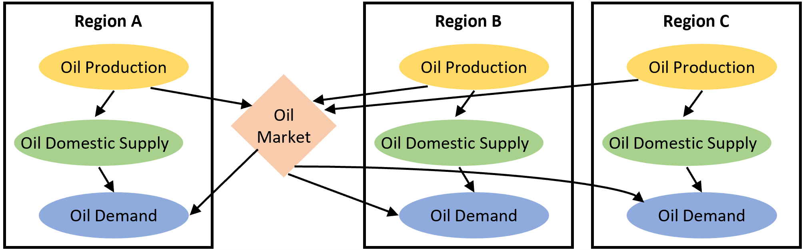

# Model inter-regional trade of fossil fuels 
Trade becomes critically important in a regionalized model setting (Uno, 2002). In a global model, the assumption of perfect self-sufficiency (i.e., global production equals global demand) neglects the need to model trade flows. However, in a regionalized model setting, this assumption becomes unrealistic given high heterogeneity between regions in terms of resource endowments, technological capacity, environmental constraints, etc. Inter-regional trade plays a key role in benefiting the exporting regions from local advantages and also meeting local demands of the importing regions if there is a deficit between regional production and demand (Dollar and Kraay, 2003). In this context, inter-regional trade must be explicitly modeled to capture the complex interactions and dependencies among regions. This also allows modelers to trace environmental responsibilities along the supply chain and quantify how one region’s policy may influence economic outcomes or emissions in others (Peters and Hertwich, 2008; Wiedmann and Lenzen, 2018).

We develop an import-based trade mechanism to model the trade of fossil fuels among the five regions. The import-based trade mechanism is only applied to the three fossil fuels (i.e., crude oil, gas, and coal, Figure 1.1) specified in FeliX. The other three renewable energy sources (i.e., biomass, solar, and wind) are assumed to be self-sufficient for each region. We use an Armington style to distinguish domestic goods from imported ones. The Armington approach assumes products are differentiated by source region, and consumers treat goods produced in different regions as imperfect substitutes(Armington, 1969). As such, fossil fuel imports of a region are from a single global pool that draws from all regions, and are also governed by a logit sharing function.

$$
S_{ij} =
\frac{\alpha_{ij} \, P_i^{-\delta}}
{\displaystyle \sum_{k} \alpha_{kj} \, P_k^{-\delta}}
$$

where $$S_{ij}$$ is the is the share of region *i* in total import of region *j*; $$\alpha_{ij}$$ is the preference parameter for fossil fuels from region *i* in region *j*; $$P_i$$ is the price of fossil fuel in region *i*； $$\delta$$ is the elasticity of substitution. The amount of a fossil fuel, either going into the international market for export or needed to be imported from international market, depending on the gaps between local demand and production of that fossil fuel. It indicates that the re-export of fossil fuels is not taken into account in the trade mechanism. The final trade matrix meets both the production and demand of fossil fuels in each region.

|
|:--|
|Figure 1.1. Import-based trade mechanism for a representative fossil fuel (i.e., oil) and three representative regions.|

## References
- Armington, P.S., 1969. A Theory of Demand for Products Distinguished by Place of Production. Staff Papers - International Monetary Fund 16, 159. https://doi.org/10.2307/3866403
- Dollar, D., Kraay, A., 2003. Institutions, trade, and growth. Journal of Monetary Economics 50, 133–162. https://doi.org/10.1016/S0304-3932(02)00206-4
- Peters, G.P., Hertwich, E.G., 2008. CO2 Embodied in International Trade with Implications for Global Climate Policy. Environ. Sci. Technol. 42, 1401–1407. https://doi.org/10.1021/es072023k
- Uno, K. (Ed.), 2002. Economy-Energy-Environment Simulation, Economy & Environment. Kluwer Academic Publishers, Dordrecht. https://doi.org/10.1007/0-306-47549-9
- Wiedmann, T., Lenzen, M., 2018. Environmental and social footprints of international trade. Nature Geosci 11, 314–321. https://doi.org/10.1038/s41561-018-0113-9

