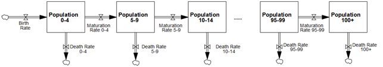
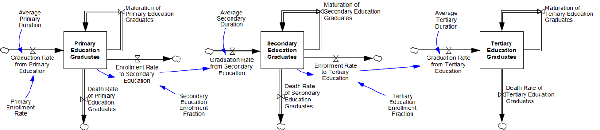

# 1. Population and education
Unlike many IAMs that take population projections as an exogenous input based on different Shared Socioeconomic Pathway (SSP) narratives (Kc et al., 2018; Riahi et al., 2017), the population module is endogenous in FeliX and conceptualized around dynamic mechanisms of population development and population ageing. Population development is governed by the population growth mechanism and the balancing effect of economic growth as well as education. The growth mechanism captures how a growing population leads to a higher economic output and how the economic growth increases the life expectancy at birth, reduces mortality, and hence further increases the population. The balancing effect mainly describes effects of increasing economic outputs and educational attainment on fertility rates.

## 1.1. Ageing structure
Population growth is based on an ageing chain and computes the male and female population size of 5-year age groups between 0 and 100+ years old (Figure 1.1).


|[](images/1_population_age_strcuture.png)
|:--|
|Figure 1.1. Inflows and outflows to different population cohorts in the population modules of FeliX. Population cohorts also distinguish gender into male and female.|


The ageing chain represents the transition of newborns through the age cohorts as they age. It means that each age cohort (except the “0–4” cohort) has one inflow (maturation of the previous cohort) and two outflows (maturation to the next cohort and mortality). Population of each gender and age interval ($Pop_{gender,age}$, Eq. 1.1) accumulates by three flows, determining the net rate of change ($\frac{dPop}{dt}$). These three flows are birth rate ($Birth_{gender,age}$), death rate ($Death_{gender,age}$), and maturation rate ($Matur_{gender,age}$) by gender and age.


```math
\frac{dPop_{gender,age}}{dt} = 
\begin{cases}
    Birth_{gender}(t)-Matur_{gender,age}(t)-Death_{gender,age}(t) &\text{if \ $age=“0‒4”$} \\
    Matur_{gender,age-1}(t)-Matur_{gender,age}(t)-Death_{gender,age}(t) &\text{if \ $“5‒9” \leq age \leq “95‒99”$} \\
    Matur_{gender,age-1}(t)-Death_{gender,age}(t) &\text{if \ $age=“100+”$} \\
\end{cases}
```
(Eq. 1.1)

$Matur_{gender,age}$ is formulated as the division of population by the interval duration ($Intvl \_ Dur$, 5 years). It assumes a homogenous distribution of population within the age group.

## 1.2. Birth rate and fertility
The birth rate (Birth_{gender}, Eq. 1.2) is the main factor affecting population dynamics, alongside the reproductive female population represented by gender and age-cohort segmentation. The birth rate is driven by education, and wealth represented by gross world product (GWP) per capita ($GWP \_ per \_ Cap$, see **2.1 Gross world product (GWP)**).

$$
Birth_{gender}(t)=
    g_{gender} \times 
    \frac
        {\sum_{age='15-19'}^{'45-49'}{Pop_{female,age}(t) \times Fert_{age}(t)}}
        {Intvl\_ Dur}
$$
(Eq. 1.2)

where g_{gender} denotes the birth gender fraction, i.e., gender fraction of registered newborns. $Fert_{age}$ refers to the age-specific fertility rate, which is the number of births per woman in a particular age group during a 5-year period. $Fert_{age}$ is formulated as a function of total fertility ($Tot\_ Fert$).

$$
Fert_{age}(t)=
L0_{age}+\frac{L_{age}}{1+e^{-k_{age}\times (Tot \_ Fert(t)-x0_{age}) }}
$$
(Eq. 1.3)

Eq. 1.3 is formulated as a logistic function, of which the parameters, $L0_{age}$, $L_{age}$, $k_{age}$, and $x0_{age}$, are calibrated based on historical data obtained from the Wittgenstein Centre Human Capital Data Explorer (Wittgenstein Centre, 2020). This formula of logistic functions will be widely used in FeliX to estimate impacts of a certain factor on interested variables.

$Tot\_ Fert$ represents the number of births per woman at reproductive ages (between 15 and 50). It considers the effects of education ($Imp\_Edu\_on\_Fert$) and wealth on fertility ($Imp\_GWP\_on\_Fert$).

$$
Tot\_ Fert(t)=
Norm\_Fert \times Imp\_Edu\_on\_Fert(t) \times Imp\_GWP\_on\_Fert(t)
$$
(Eq. 1.4)

where $Norm\_Fert$ is the reference value of fertility, equal to the historical value of 2.63 births per woman in year 2000. This formulation also prevents a strong assumption on the monotonic dependence of fertility solely on education or solely on economic output. $Imp\_Edu\_on\_Fert$ and $Imp\_GWP\_on\_Fert$ are formulated as logistic functions based on mean years  of schooling ($MYS$, see **1.4. Educational attainment and mean years of schooling**) and $GWP \_ per \_ Cap$, respectively.

$$
Imp\_Edu\_on\_Fert(t)=
    L0\_Edu\_Fert+
    \frac
        {L\_Edu\_Fert}
        {1+e^{-k\_Edu\_Fert \times (\frac{MYS(t)}{MYS\_2000}-x0\_Edu\_Fert) }}
$$
(Eq. 1.5)

$$
Imp\_GWP\_on\_Fert(t)=
    L0\_GWP\_Fert+
    \frac
        {L\_GWP\_Fert}
        {1+e^{-k\_GWP\_Fert \times (\frac{GWP \_ per \_ Cap(t)}{GWP \_ per \_ Cap\_2000}-x0\_GWP\_Fert) }}
$$
(Eq. 1.6)

Similar to parameters in Eq. 1.4 (e.g., $L0_{age}$, $L_{age}$), parameters used in Eq. 1.5 are calibrated based on historical data of $MYS$ obtained from the Wittgenstein Centre Human Capital Data Explorer (Wittgenstein Centre, 2020) while parameters used in Eq. 1.6 are calibrated based on historical data of $GWP \_ per \_ Cap$ from the World Bank (2020).

## 1.3. Mortality rate and life expectancy at birth
Death rate ($Death_{gender,age}$) refers to the number of people who pass away in each gender and age group per year. It is formulated as a fraction of the population of each group.

$$
Death_{gender,age}(t)=
    Pop_{gender,age} \times Mort_{gender,age}
$$
(Eq. 1.7)

where $Mort_{gender,age}$ is the mortality fraction by gender and age cohort. $Mort_{gender,age}$ is calculated as a logistic function based on global average life expectancy at birth ($LE$).

$$
Mort_{gender,age}(t)=
    M0_{gender,age}+
    \frac
        {L\_Mort_{gender,age}}
        {1+e^{-k\_Mort_{gender,age} \times 
            (
                \frac
                    {LE(t)}
                    {LE\_2000}
                -x0\_Mort_{gender,age}
            ) }}

$$
(Eq. 1.8)

$LE$ is obtained by a multiplicative function considering impacts of wealth ($Imp\_GWP\_on\_LE$), impacts of education ($Imp\_Edu\_on\_LE$), impacts of total food supply ($Imp\_Food\_on\_LE$), and impacts of climate change ($Imp\_CC\_on\_LE$) on a reference value of $LE$―the observed life expectancy at birth in 2000 ($LE\_2000$).

$$
LE(t)=
    LE\_2000 
    \times Imp\_GWP\_on\_LE(t)
    \times Imp\_Edu\_on\_LE(t) 
    \times Imp\_Food\_on\_LE(t) 
    \times Imp\_CC\_on\_LE(t)
$$
(Eq. 1.9)

The first three impacts on life expectancy are estimated by logistic functions based on $GWP \_ per \_ Cap$ (The World Bank, 2020), $MYS$ (Wittgenstein Centre, 2020), and total daily calorie supply per capita (FAOSTAT, 2020a), respectively. Parameters used in these logistic functions as well as Eq. 1.8 (e.g., $ M0_{gender,age}$ and $L\_Mort_{gender,age}$) are calibrated based on historical data. The last impact of climate change on $LE$ ($Imp\_CC\_on\_LE$) is estimated depending on temperature in the future. Global temperature rise is the main driver of climate mortality―the death rate directly attributed to the impacts of climate change such as extreme weather events, rising temperatures, and related environmental changes (IPCC 2022b). Meanwhile, education is expected to mediate climate mortality. To quantify $Imp\_CC\_on\_LE$, we first estimate climate change impacts on mortality ($Imp\_CC\_on\_Mort$). $Imp\_CC\_on\_Mort$ is estimated by taking into account both temperature and education, and calibrated to the estimates of Bressler et al. (2021). $Imp\_CC\_on\_LE$ is inversely proportional to $Imp\_CC\_on\_Mort$.

$$
Imp\_CC\_on\_LE(t)=
    \frac
        {1}
        {1+Imp\_CC\_on\_Mort(t)}
$$
(Eq. 1.10)

## 1.4. Educational attainment and mean years of schooling

**Educational attainment**

Population by age cohort feeds into the education module to compute the population of primary, secondary, and tertiary education graduates according to the enrollment rates and graduation rates (Figure 1.2). 

|[](images/1_education_strcuture.png)
|:--|
|Figure 1.2. Inflows and outflows to different education graduates.|

Population with each educational attainment level, similar to the population chain, accounts for the ageing of people who graduate from each level and for transitions between the education levels. In detail, primary, secondary, and tertiary education graduates accumulate by each gender and 5-year age group corresponding to the respective education level. We make the following assumptions for the correspondence of age groups to education levels.
- Children enroll to primary education when they are 5‒9 years old. The enrollment rate to primary education is a fraction of the population aged 5‒9 ($Pop_{gender,“5‒9”}$).
- Average duration of primary education is 6 years, as reported by the United Nations Educational, Scientific and Cultural Organization (UNESCO) for the recent decades. Children graduate from primary education when they are in the “10‒14” or “15‒19” age groups.
- A fraction of 10‒14 and 15‒19 years old primary education graduates enroll into secondary education. Average duration of secondary education is also 6 years, such that people are in the “15‒19”, “20‒24” or “25‒29” age groups when they graduate from secondary education.
- Enrollment to tertiary education occurs only in the “15‒19”, “20‒24” and “25‒29” age groups. The average duration of tertiary education is 5 years. Therefore, people graduate from tertiary education in the age groups “20‒24”, “25‒29” or “30‒34”.

Net change rate of primary education graduates ($\frac{dPEG}{dt}$) for each gender-age group is formulated as:

$$
\frac{dPEG_{gender,age}(t)}{dt} = 
\begin{cases}
    0 &\text{if \ $age \ in \ \{“0‒4”,“5‒9”\}$} \\
    Grad\_Prim_{gender,age}(t)-Enrl\_Sec_{gender,age}(t)-Matur\_Prim_{gender,age}(t)-Death\_Prim_{gender,age}(t) &\text{if \ $age \ in \ \{“10‒14”,“15‒19”\}$} \\
    Matur\_Prim_{gender,age-1}(t)-Matur\_Prim_{gender,age}(t)-Death\_Prim_{gender,age}(t) &\text{if $age \geq “20‒24”$} \\
\end{cases}
$$
(Eq. 1.11)

where $Grad\_Prim_{gender,age}$ is graduation rate from primary education (Eq. 1.12), which is equal to enrollment rate to primary education ($Enrl\_Prim_{gender}$, Eqs. 13 and 14) yet after a delay of average duration of primary education ($Delay\_Prim$).

$$
Grad\_Prim_{gender,age}(t)= 
\begin{cases}
    DELAY1(Enrl\_Prim_{gender}(t),Delay\_Prim) \times \frac{4}{5} &\text{if \ $age=“10‒14”$} \\
    DELAY1(Enrl\_Prim_{gender}(t),Delay\_Prim) \times \frac{1}{5} &\text{if \ $age=“15‒19”$}
\end{cases}
$$
(Eq. 1.12)

$$
Enrl\_Prim_{gender}(t) = Pop_{gender,“5‒9”}(t) \times PEF_{gender}(t)
$$
(Eq. 1.13)

$$
PEF_{gender}(t) =  Ref\_PEF_{gender}(t) \times Imp\_GWP\_on\_Prim_{gender}(t)
$$
(Eq. 1.14)

In Eq. 1.12, $DELAY1$  is a predefined function in the Vensim software, representing first order exponential delay. In addition, we assume that 80% of the children graduate when they are 10‒14 years old, and 20% graduate when they are 15‒19 years old. In Eq. 1.13, $PEF_{gender}$ is the primary education enrollment fraction for each gender which is defined as a reference value ($Ref\_PEF_{gender}$, as the maximum possible enrollment fraction) multiplied by the impact of wealth ($Imp\_GWP\_on\_Prim_{gender}$). $Imp\_GWP\_on\_Prim_{gender}$ is formulated as a logistic function and calibrated based on $GWP\_per\_Cap$.

$Matur\_Prim_{gender,age}$ and $Death\_Prim_{gender,age}$ in Eq. 1.11  are maturation and death rates of primary education graduates, respectively, calculated by Eq. 1.15 and Eq. 1.16.

$$
Matur\_Prim_{gender,age}(t) =  
    Matur_{gender,age}(t) \times 
    \frac 
    {PEG_{gender,age}(t)}
    {Pop_{gender,age}(t)}
$$
(Eq. 1.15)

$$
Death\_Prim_{gender,age}(t) =  
    Death_{gender,age}(t) \times 
    \frac 
    {PEG_{gender,age}(t)}
    {Pop_{gender,age}(t)}
$$
(Eq. 1.16)

The formulation of secondary and tertiary education graduates follows Eqs. 11-16, with differences in the age groups explained in the list of assumptions above. Enrollment to secondary (tertiary) education is assumed to be fraction of the primary (secondary) education graduates, implying that the previous education level is a prerequisite for enrollment. The effect of GWP on enrollment for each education level is calibrated to historical data from WCDE (Wittgenstein Centre, 2020).

**Mean years of schooling (MYS)**
Mean years of schooling ($MYS$) is used to define the effect of education on fertility rates and life expectancy. $MYS$ is formulated as the weighted average of the duration of each education level. The weights are determined by the total number of graduates for the respective education level relative to the population aged 15 and above.

$$
MYS(t) =  
    \frac 
    {
        Delay\_Prim \times \sum_{age\geq“15‒19”} { \sum_{gender} {PEG_{gender,age}(t)}}+
        (Delay\_Prim+Delay\_Sec) \times \sum_{age\geq“15‒19”} { \sum_{gender} {SEG_{gender,age}(t)}}+
        (Delay\_Prim+Delay\_Sec+Delay\_Tert) \times \sum_{age\geq“15‒19”} { \sum_{gender} {TEG_{gender,age}(t)}}
    }
    {\sum_{age\geq“15‒19”} { \sum_{gender} {Pop_{gender,age}(t)}}}
$$
(Eq. 1.17)

where $SEG_{gender,age}$ and $TEG_{gender,age}$ refer to secondary and tertiary education graduates, respectively, calculated in the same way of $PEG_{gender,age}$ (Eq. 1.11).

## 1.5. Labor force
Labor force in FeliX is distinguished as skilled ($LF_{skilled}$) and unskilled labor force ($LF_{unskilled}$). The skilled labor force is the sum of total population aged 15-64 with tertiary education and half of the population aged 15–64 with secondary education. The unskilled labor force is determined by the remaining population aged 15–64.

## References
- Bressler, R.D., Moore, F.C., Rennert, K., Anthoff, D., 2021. Estimates of country level temperature-related mortality damage functions. Sci Rep 11, 20282. https://doi.org/10.1038/s41598-021-99156-5
- FAOSTAT, 2020. Food Balance Sheets.
- Intergovernmental Panel On Climate Change (Ipcc), 2022. Climate Change 2022 – Impacts, Adaptation and Vulnerability: Working Group II Contribution to the Sixth Assessment Report of the Intergovernmental Panel on Climate Change, 1st ed. Cambridge University Press. https://doi.org/10.1017/9781009325844
- Kc, S., Wurzer, M., Speringer, M., Lutz, W., 2018. Future population and human capital in heterogeneous India. Proc. Natl. Acad. Sci. U.S.A. 115, 8328–8333. https://doi.org/10.1073/pnas.1722359115
- Lopez, A.D., Murray, C.C.J.L., 1998. The global burden of disease, 1990–2020. Nat Med 4, 1241–1243. https://doi.org/10.1038/3218
- Riahi, K., Van Vuuren, D.P., Kriegler, E., Edmonds, J., O’Neill, B.C., Fujimori, S., Bauer, N., Calvin, K., Dellink, R., Fricko, O., Lutz, W., Popp, A., Cuaresma, J.C., Kc, S., Leimbach, M., Jiang, L., Kram, T., Rao, S., Emmerling, J., Ebi, K., Hasegawa, T., Havlik, P., Humpenöder, F., Da Silva, L.A., Smith, S., Stehfest, E., Bosetti, V., Eom, J., Gernaat, D., Masui, T., Rogelj, J., Strefler, J., Drouet, L., Krey, V., Luderer, G., Harmsen, M., Takahashi, K., Baumstark, L., Doelman, J.C., Kainuma, M., Klimont, Z., Marangoni, G., Lotze-Campen, H., Obersteiner, M., Tabeau, A., Tavoni, M., 2017. The Shared Socioeconomic Pathways and their energy, land use, and greenhouse gas emissions implications: An overview. Global Environmental Change 42, 153–168. https://doi.org/10.1016/j.gloenvcha.2016.05.009
- The World Bank, 2020. World Bank Open Data.
- Wittgenstein Centre, 2020. Wittgenstein Centre human capital data explorer. http://dataexplorer.wittgensteincentre.org/wcde-v2/.


[def]: _layouts/mathjax.html