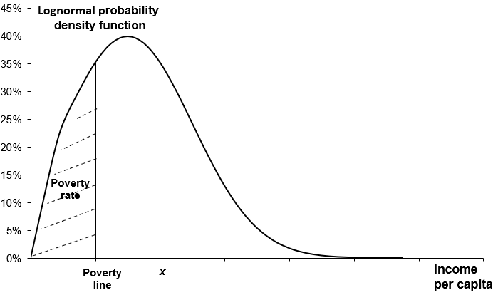
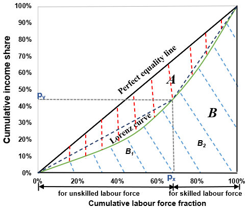

# 2. Economy

## 2.1. Gross world product (GWP)
Gross world product ($$GWP$$) in the FeliX model is determined by the total reference economic output ($$REO$$), further influenced by impacts from climate changes ($$Imp\_CC\_on\_GWP$$) and biodiversity ($$Imp\_Biodiv\_on\_GWP$$).
$$
GWP(t)=REO(t) \times Imp\_CC\_on\_GWP(t) \times Imp\_Biodiv\_on\_GWP(t)
$$

(Eq. 2.1)

$$Imp\_CC\_on\_GWP$$ is related to the climate change damage (details see the section **2.2 Climate impacts on GWP**), and $$Imp\_Biodiv\_on\_GWP$$ is an endogenous variable related to the mean species abundance ($$MSA$$) from the biodiversity module (the section [9. Biodiversity](9_biodiversity.md)). The total $$REO$$ is the sum of the $$REO$$ generated by the labor force by skill ($$REO_{skill}$$). As mentioned in **1.5 Labor force**, skill of labor force is distinguished into skilled and unskilled. $$REO_{skill}$$ are computed based on a Cobb‑Douglas production function, depending on the technology ($$\varphi\_Tech_{skill}$$) and capital ($$\varphi\_K_{skill}$$) allocated to the labor force, and the size of the labor force input.

$$
REO_{skill}(t)=
    REO\_Init_{skill} \times 
    \varphi \_ Tech _ {skill}(t) \times
    Tech(t) \times
    \Big( \varphi \_ K _ {skill}(t) \times
        \frac
            {K(t)}
            {K\_Init}
    \Big) ^ {CEO_{skill}} \times
    \sum_{gender}{\sum_{age=“15‒19”}^{“60‒64”}{LF\_Input_{gender,age,skill}(t) ^ {(1-CEO_{skill})} }}
$$

(Eq. 2.2)

where $$CEO_{skill}$$ is the capital elasticity output for skilled and unskilled labor force. $$REO\_Init_{skill}$$, $$\varphi\_Tech_{skill}$$, $$\varphi\_K_{skill}$$, and $$CEO_{skill}$$ are exogenous parameters determined by model calibration based on historical data of $$GWP$$ and $$GWP\_per\_Cap$$ from The World Bank (2020). Technology-related factor productivity ($$Tech$$) is distinguished into energy technology ($$Tech\_Eng$$) and all other technology ($$Tech\_Oth$$). Particularly, $$Tech\_Eng$$ is endogenously determined by investments in the energy module while $$Tech\_Oth$$ follows an exogenous trend and data. The labor force input ($$LF\_Input_{gender,age,skill}$$) is the corresponding labor force multiplied by the labor force participation rates for the respective groups (by gender and age cohort), which is set to be 34‒78% depending on genders and age cohorts following The World Bank (2020).

$$GWP\_per\_Cap$$ is hence calculated as $$GWP$$ divided by total population.

$$
GWP\_per\_Cap(t)=
    \frac
        {GWP(t)}
        {\sum_{gender}{\sum_{age}{Pop_{gender,age}(t)}}}
$$

(Eq. 2.3)

## 2.2. Climate change impacts on GWP
Impacts of climate change on economy ($$Imp\_CC\_on\_GWP$$) is reflected in the economic loss due to climate damage, which is defined by a fraction of GWP.

$$
Imp\_CC\_on\_GWP(t)= 1-D(t), 
    \ where \ D(t) = 
        \begin{cases}
            0 &\text{if $S\_D = 0$} \\
            D\_N(t) &\text{if $S\_D = 1$} \\
            D\_DS(t) &\text{if $S\_D = 2$} \\
            D\_B1(t) &\text{if $S\_D = 3$} \\
            D\_B2(t) &\text{if $S\_D = 4$} \\
            D\_L(t) &\text{if $S\_D = 5$} \\
        \end{cases}
$$

(Eq. 2.4)

In FeliX, an optional structure that enables using the damage functions obtained from previous studies (Burke et al., 2015; Dietz and Stern, 2015; Kalkuhl and Wenz, 2020; Nordhaus, 2017; Weitzman, 2012), or a custom function defined in a flexible logistic form (Eq. 2.7). $$S\_D$$ is a climate damage function switch that allows users to switch between the options.

$$D\_N(t)$$ is the damage function used by Nordhaus (2017).
$$
D\_N(t)=
    1-\frac
        {1}
        {1+\alpha T(t)+\beta T(t)^2}
$$

(Eq. 2.5)

where $$T$$ is the global mean temperature change from preindustrial times and the parameters $$\alpha$$ and $$\beta$$ are -0.00118 and 0.00278, respectively, yielding the percentage damage.

$$D\_DS(t)$$ is the function used by Dietz and Stern (2015).

$$
D\_DS(t)=
    1-\frac
        {1}
        {
            1
            +
            \Big( \frac
                    {T(t)}
                    {\delta _1}
            \Big) ^ {\varepsilon _1}
            +
            \Big( \frac
                    {T(t)}
                    {\delta _2}
            \Big) ^ {\varepsilon _2}
        }
$$

(Eq. 2.6)

where the parameters $$\delta_1$$, $$\delta_2$$, $$\varepsilon_1$$ and $$\varepsilon_2$$ are 12.2, 4.0, 2.0 and 7.02, respectively.

$$D\_B1$$ and $$D\_B2$$ are short-term pooled and long-term differentiated damage estimates of Burke et al. (2015), and they are defined in a lookup form digitalized from the figures in their paper. Table 2.1 lists those point estimates used in the model.

{: .table}
> Table 2.1. Damage estimates of Burke et al. (2015) for short-term pooled (D_B1) and long-term differentiated (D_B2) responses.

|T ($$^\circ C$$)| $$D\_B1$$ (%)| $$D\_B2$$ (%)
|---:|---:|---:|
|1.0|1.0|6.3|
|2.0|13.0|35.0|
|3.0|19.0|55.0|
|4.0|20.5|68.7|
|5.0|21.0|80.0|

$$D\_L(t)$$ is a logistic function that can be used to define custom-shaped damage functions using three parameters $$L\_D$$ (the saturation level), $$k\_D$$ (steepness), and $$x0\_D$$ (the inflection point).
$$
D\_L(t)= 
    \frac
        {L\_D}
        {1
            +
        e^{-k\_D \times (T(t)-x0\_D)}
        }
$$

(Eq. 2.7)

## 2.3. Poverty
The global poverty rate ($$PR$$) is defined as the proportion of the population aged 15+ living below the international extreme poverty line ($$PL$$, $2.15 per capita per day in 2017 PPP). It is the sum of the poverty rates across the different population groups aged over 15 weighted by their corresponding population shares.

$$
PR(t)=
    \frac
        {\sum_{gender}{\sum_{age \geq “15‒19”}{PR_{gender,age}(t) \times Pop_{gender,age}(t)}}}
        {\sum_{gender}{\sum_{age}{PR_{gender,age}(t)}}}
$$

(Eq. 2.8)

The poverty rate of each population group ($$PR_{gender,age}$$) is the share of the population living below a specified poverty level $$PL$$ (Figure 2.1) (Fosu, 2010; Hughes, 2015). When calculating $$PR_{gender,age}$$, income per capita ($$Income\_per\_Cap_{gender,age}$$) is assumed to follow a log-normal distribution characterized by the mean ($$\mu_{gender,age}$$) and standard deviation ($$\sigma_{gender,age}$$) of the normal distribution function of $$\ln(Income\_per\_Cap_{gender,age})$$, based on previous research (Fosu, 2010; Lakner et al., 2022; Liu et al., 2023).
$$
PR_{gender,age}(t)(Income\_per\_Cap_{gender,age}) \leq PL) =
    \emptyset \Big(
            \frac
                {\ln(PL)- \mu_{gender,age}(t)}
                {\sigma _{gender,age}(t)}
        \Big)
$$

(Eq. 2.9)

|
|:--|
|Figure 2.1. The lognormal probability density function of income. The shaded area is equal to the poverty rate.|

The standard normal cumulative distribution function can be obtained by looking up the standard normal distribution table.

$$
\emptyset \Big(
        \frac
            {\ln(Income\_per\_Cap_{gender,age})- \mu_{gender,age}(t)}
            {\sigma _{gender,age}(t)}
    \Big) = 

    \int_{-\infty}^
            {\frac
                {\ln(Income\_per\_Cap_{gender,age})- \mu_{gender,age}(t)}
                {\sigma _{gender,age}(t)}
            }
            {\frac
                {1}
                {\sqrt{2\pi}}
            e^{-\frac
                    {(\ln(Income\_per\_Cap_{gender,age}-\mu_{gender,age}(t))^2}
                    {2\sigma ^2 _{gender,age}(t)}
            }
            } \,dx 
$$

(Eq. 2.10)

The probability density function of income is shown in Eq. 2.11 and Figure 2.1 (Fosu, 2010; Mendez Ramos, 2019).

$$
f(Income\_per\_Cap,\mu_,\sigma,t) = 
    \frac
        {1}
        {\sqrt{2\pi} \sigma _{gender,age}(t)}
    e^{-\frac
            {(\ln(Income\_per\_Cap_{gender,age}-\mu_{gender,age}(t))^2}
            {2\sigma ^2 _{gender,age}(t)}
    },\ \ln(Income\_per\_Cap) \sim N(\mu_,\sigma)
$$

(Eq. 2.11)

To get $$PR_{gender,age}$$, given the poverty line, only $$\mu_{gender,age}$$ and $$\sigma_{gender,age}$$ need to be computed. Eq. 2.12 shows the relationship between $$Income\_per\_Cap_{gender,age}$$, $$\mu_{gender,age}$$ and $$\sigma_{gender,age}$$ (Chotikapanich et al., 1997; Dixon et al., 1987).

$$
Income\_per\_Cap_{gender,age}(t) = 
e^{\mu_{gender,age}(t)} +
\frac
    {\sigma ^2 _{gender,age}(t)}
    {2}
$$

(Eq. 2.12)

where $$\mu_{gender,age}$$ is a function of $$\sigma_{gender,age}$$ and $$Income\_per\_Cap_{gender,age}$$ (Dixon et al., 1987). $$\sigma_{gender,age}$$ can be expressed as a function of the Gini coefficient.

$$
\sigma _{gender,age}(t) = 
\sqrt{2} \emptyset ^{-1} 
\Big(
    \frac 
        {Gini_{gender,age}(t)+1}
        {2}
\Big)
$$

(Eq. 2.13)

where $$\emptyset^{-1}$$  is the inverse standard normal cumulative distribution function, and its value can be obtained through the inverse query of the standard normal distribution. To calculate $$\mu_{gender,age}$$ and $$\sigma_{gender,age}$$, we thus need to calculate $$Gini_{gender,age}$$ and $$Income\_per\_Cap_{gender,age}$$. The Gini coefficient is a numerical value derived from the Lorenz curve (Gastwirth, 1972) as a graphical measure of the income distribution (Figure 2.2).  Let $$A$$ denote the area between the perfect equality line and the Lorenz curve, and $$B$$ (the sum of $$B1$$ and $$B2$$) the area beneath the Lorenz curve (Figure 2.2). $$Gini_{gender,age}$$ can thus be defined by Eq. 2.14 (Dixon et al., 1987).

$$
Gini_{gender,age}(t)=
\frac
    {A_{gender,age}(t)}
    {A_{gender,age}(t)+B_{gender,age}(t)}
=
\frac
    {0.5-B_{gender,age}(t)}
    {0.5}
=1-2B_{gender,age}(t)
$$

(Eq. 2.14)

|
|:--|
|Figure 2.2. Income distribution measured by Lorenz curve. The cumulative labor force fraction at a point on the x-axis is defined as the size of cumulative labor force at this point divided by the size of the total labor force. The x-value of px and a y-value of py mean that the unskilled labor force (the bottom px of the labor force) controls the proportion py of the total income. The Gini coefficient is a numerical value derived from the Lorenz curve to measure income distribution, which is defined as $$A/(A+B)$$. Here, $$A$$ and $$B$$ represent the sizes of the red and blue striped areas. $$B$$ is the sum of $$B1$$ and $$B2$$. The sum of $$A$$ and $$B$$ is 0.5. The perfect equality line corresponds to a Gini coefficient of 0, indicating that every person has the same income.|

By using a triangle and a trapezoid to approximate the areas of $$B1$$ and $$B2$$ (Figure 2.2) (Hughes, 2015), $$Gini_{gender,age}$$ can be reformulated by Eq. 2.15.
$$
Gini_{gender,age}(t)= 1-
\frac
    {1}
    {Tot \_Rel\_Income_{gender,age} \times LF_{gender,age}(t)} 
\times 
\Big[
    LF_{gender,age,unskilled}(t) \times Rel\_Income_{gender,age,unskilled} +
    LF_{gender,age,skilled}(t) \times (2 \times Rel\_Income_{gender,age,unskilled}+Rel\_Income_{gender,age,skilled})
\Big]
$$

(Eq. 2.15)

where $$Tot\_Rel\_Income_{gender,age}$$, $$Rel\_Income_{gender,age,unskilled}$$, and $$Rel\_Income_{gender,age,skilled}$$ denote the relative income of the total, unskilled, and skilled labor force of the corresponding population group, respectively. $$Tot\_Rel\_Income_{gender,age}$$ is assumed to be 100. The values of $$Rel\_Income_{gender,age,unskilled}$$ and $$Rel\_Income_{gender,age,skilled}$$ are based on relative earnings data for OECD countries (OECD, 2020).

$$Income\_per\_Cap_{gender,age}$$ is related to the $$GWP\_per\_Cap$$.
$$
Income\_per\_Cap_{gender,age}(t) = GWP\_per\_Cap_{gender,age}(t) \times Real\_Income\_Param_{gender,age}
$$

(Eq. 2.16)

where $$Real\_Income\_Param_{gender,age}$$ is determined by model calibration based on data from the World Bank (2020).

## References:
- The World Bank (2020). GDP per capita (current US$). https://data.worldbank.org/indicator/NY.GDP.PCAP.CD?name_desc=false. 
- Nordhaus, W.D. (2017). Revisiting the social cost of carbon. Proceedings of the National Academy of Sciences 114, 1518-1523. https://doi.org/10.1073/pnas.1609244114. 
- Dietz, S., and Stern, N. (2015). Endogenous growth, convexity of damage and climate risk: How nordhaus' framework supports deep cuts in carbon emissions. The Economic Journal 125, 574-620. https://doi.org/10.1111/ecoj.12188. 
- Weitzman, M.L. (2012). Ghg targets as insurance against catastrophic climate damages. Journal of Public Economic Theory 14, 221-244. https://doi.org/10.1111/j.1467-9779.2011.01539.x. 
- Kalkuhl, M., and Wenz, L. (2020). The impact of climate conditions on economic production. Evidence from a global panel of regions. Journal of Environmental Economics Management 103, 102360. https://doi.org/10.1016/j.jeem.2020.102360. 
- Burke, M., Hsiang, S.M., and Miguel, E. (2015). Global non-linear effect of temperature on economic production. Nature 527, 235-239. https://doi.org:10.1038/nature15725. 
- Hughes, B.B. (2015). International futures (ifs) economic model documentation.  https://pardee.du.edu/sites/default/files/Economics%20Documentation%20v43%20clean.pdf. 
- Fosu, A.K. (2010). Inequality, income, and poverty: Comparative global evidence. Social Science Quarterly 91, 1432-1446. 10.1111/j.1540-6237.2010.00739.x. 
- Lakner, C., Mahler, D.G., Negre, M., et al. (2022). How much does reducing inequality matter for global poverty? The Journal of Economic Inequality, 1-27. https://doi.org/10.1007/s10888-021-09510-w. 
- Liu, Q., Gao, L., Guo, Z., et al. (2023). Robust strategies to end global poverty and reduce environmental pressures. One Earth 6, 392-408. https://doi.org/10.1016/j.oneear.2023.03.007. 
- Mendez Ramos, F. (2019). Uncertainty in ex-ante poverty and income distribution: Insights from output growth and natural resource country typologies. World Bank Policy Research Working Paper. 10.1596/1813-9450-8841. 
- Kakwani, N.C. (1980). Income inequality and poverty (World Bank). 
- Chotikapanich, D., Valenzuela, R., and Rao, D.P. (1997). Global and regional inequality in the distribution of income: Estimation with limited and incomplete data. Empirical Economics 22, 533-546. 10.1007/BF01205778. 
- Dixon, P.M., Weiner, J., Mitchell-Olds, T., et al. (1987). Bootstrapping the gini coefficient of inequality. Ecology 68, 1548-1551. 10.2307/1939238. 
- Gastwirth, J.L. (1972). The estimation of the lorenz curve and gini index. The Review of Economics and Statistics, 306-316. 10.2307/1937992. 
- OECD (2023). Education and earnings. https://stats.oecd.org/Index.aspx?DataSetCode=EAG_EARNINGS  