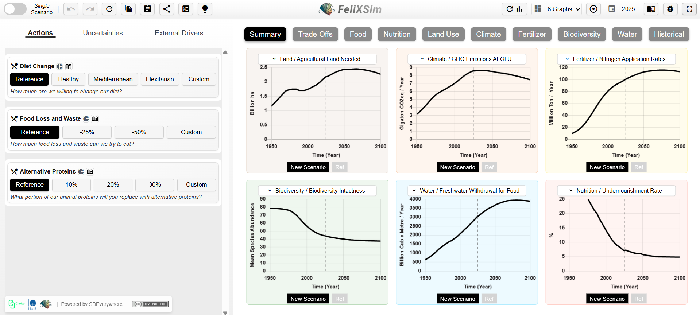

e---
title: Issue 1 - Early 2026
layout: default
parent: Newsletters
nav_order: 1
math: katex
description: Newsletter Issue 1 - Early 2026
---

# Issue 1 - Early 2026

Welcome to the first edition of the FeliX Modeling Community Newsletter! This biannual update is designed to keep partners, collaborators, and users informed about the latest news and developments related to the FeliX model, as well as recent publications and opportunities to engage with the community. As the model continues to evolve, our goal is to increase transparency, share methodological progress, and support the growing network of researchers and stakeholders who are applying FeliX to various fields.

[FeliX is a system dynamics model](https://iiasa.ac.at/models-tools-data/felix) of the interactions between the global climate, economy, environment, and society, hosted at the International Institute for Applied Systems Analysis (IIASA). The model is [publicly available](https://github.com/iiasa/Felix-Model) and supported by this online documentation.

## Latest Publications

- Eker, S, Reiter, C, Liu, Q., et al. (2026) [Wellbeing cost of carbon](https://doi.org/10.1017/sus.2025.10042). *Global Sustainability*, **9**, e1.

- Yu, L., Wu, X., Sang, S., et al. (2026) [Yellow River Basin water stress has eased but may persist without enhanced efficiency and sustainable agriculture](https://doi.org/10.1038/s44458-025-00005-7). *Communications Sustainability*, **1**, 9.

- Yang, J., Gao, L., Guo, Z., et al. (2025) [Integrative Sustainable Development Goal policy portfolios to accelerate global progress towards a more sustainable future: a modelling study](https://doi.org/10.1016/j.lanplh.2025.101318). *Lancet Planetary Health*, **9**(12): 101318.

- Liu, Q., Guo, Z., Guo, M., et al. (2025). [Assessing the Dynamic Evolution of Global Energy Poverty Under Uncertain Climate Trends–Shaped Future Pathways](https://doi.org/10.1002/sd.70396). *Sustainability Science*, **34**(S2): 1203-1220.

**See [all publication](3_publication.md)**.

## Recent Model updates
### Regionalized version
A regionalized version of FeliX (FeliX_R5) has been released on GitHub. A regionalized version of FeliX is in high demand due to the significant heterogeneity across regions and nations. FeliX_R5 breaks the world down into five regions according to the United Nations' regional classifications: African States (Africa), Asia-Pacific States (AsiaPacific), Eastern European States (EastEu), Latin American and Caribbean States (LAC), and Western European and Other States (WestEu_Dev), which includes the United States, Canada, Australia, and New Zealand. Ten key human-nature system modules, such as population, educational levels, the economy, and energy production and demand, are adapted to reflect regional variability. The FeliX_R5 solves challenges including the complexity of multidimensional calibration, the need to model interregional trade, and the requirement for comprehensive regional datasets. 

Learn more about [FeliX_R5](https://github.com/iiasa/Felix-Model/tree/master/Regionalized%20FeliX).

### FeliXSim
FeliXSim is an Interactive Simulation Environment that makes the system dynamics IAM FeliX accessible to non-experts. The tool focuses on behavioral change in the food system, allowing users to explore how dietary shifts and reduced food waste scale into system-wide environmental impacts. We demonstrate how such interactive tools can support more inclusive and participatory scenario development.

|
|:--|

Learn more about [FeliXSim](https://climatechoice.github.io/felix/)

### Emissions and Energy

The global version of FeliX also went through substantial improvements, especially regarding the emissions and energy. Earlier version of FeliX used exogenous inputs for the radiative forcing of the non-CO2 greenhouse gases. The emissions sector been extended to explicitly account for the non-CO2 greenhouse gases, their atmospheric cycles and the resulting climate impacts. Here is a summary what emission drivers are now in the model.

In the energy module, learning curves, cost structures and conversion efficiency dynamics of the solar and wind have been updated to capture the recent actual developments.

| **Sector**         | **Activity**              | **CO₂** | **CH₄** | **N₂O** | **Equation** |
|--------------------|---------------------------|:------:|:------:|:------:|:------:|
| **Agriculture**    | Livestock & Manure        |        | 🟢     | 🔵     | 9.2    |
|                    | Rice Cultivation          |        | 🟢     |        | 9.3    |
|                    | Crop Residue Burning      |        | 🟢     | 🔵     | 9.4    |
|                    | Agricultural Soils        |        |        | 🔵     | 9.5    |
| **LULUCF**         | Burning Biomass           | 🔴     | 🟢     | 🔵     | 9.6    |
|                    | Net Forest Conversion     | 🔴     |        |        | 9.7    |
|                    | Forestland                | 🔴     |        |        | 9.8    |
|                    | Drained Organic Soils     | 🔴     |        |        | 9.9    |
| **Energy**         | Oil Production            | 🔴     | 🟢     | 🔵     | 9.10-12  |
|                    | Coal Production           | 🔴     | 🟢     | 🔵     | 9.10-12  |
|                    | Gas Production            | 🔴     | 🟢     | 🔵     | 9.10-12  |
|                    | Biomass Production        | 🔴     | 🟢     | 🔵     | 9.10-12  |
|                    | Solar Production          | 🔴     |        |        | 9.10-12   |
|                    | Wind Production           | 🔴     |        |        | 9.10-12   |
| **Industry & Waste** | Waste Disposal          |        | 🟢     |        | 9.13   |
|                    | Industrial Activity       |        |        | 🔵     | 9.14   |

Learn more about [Emissions and Energy](1_1_9_emissions.md) in FeliX.

## Current Projects
### CHOICE
[The CHOICE project](https://www.climatechoice.eu/) combines interdisciplinary methods and immersive tools in a unique way. This combination improves the integration of behavioral change and actor heterogeneity in food systems in IAMs. It also makes these models more accessible and relevant for everyday decision-making.

### WorldTrans
[WorldTrans](https://worldtrans-horizon.eu/) develops more transparent identity and access management (IAM) systems that better integrate social heterogeneity, behavioral feedback, and climate–society interactions. These systems have a strong focus on citizen and stakeholder engagement to support the goals of the European Green Deal.

## News from the FeliX community
- At the [2nd HYDRA webinar](https://www.climatechoice.eu/2025/11/03/choice-at-the-2nd-hydra-webinar-focusing-on-integrated-assessment-models/), CHOICE highlighted how it applies and extends IAMs—including FeliX—to explore food system transitions and behaviour-informed climate action, demonstrating their role in evidence-based policymaking and broadening the use of IAMs beyond traditional applications.

- The [FeliX ISE poster attracted strong interest](https://pure.iiasa.ac.at/id/eprint/21004/) at the [Scenarios Forum](https://www.climatechoice.eu/2025/09/04/reimagining-climate-action-with-felix-ise-insights-from-scenarios-forum-2025/) from a multidisciplinary audience, highlighting the tool’s clarity, participatory potential, and relevance for teaching, policy, and public engagement, with valuable feedback provided to further improve its design and usability.

- In the last year, FeliX has attracted growing interest from outside. Visitors from Peking University, Toshiba, the University of Oxford, and the Potsdam Institute for Climate Impact Research as well as others have visited us to learn about the model and its uses.

## About Us
FeliX is supported by a [collaborative team of modelers and researchers at IIASA](https://iiasa.ac.at/models-tools-data/felix) who specialize in energy systems, land use, climate policy, behavioral dynamics, and Earth system feedback. The group leads ongoing model development, calibration, application, and community engagement.

## Questions and next issue
We are always available to answer any questions you may have.

Please reach us also for the news you’d like to have included in the next issue.

Our mailing address is: felixmodel@iiasa.ac.at. Click [here](mailto:felixmodel@iiasa.ac.at?subject=FeliX%20Newsletter&body=) to send us an email!

*Copyright (C) 2025 International Institute of Applied Systems Analysis. All rights reserved. [Terms and conditions](https://iiasa.ac.at/sites/default/files/2026-02/IIASA%20FeliX%20Newsletter%20-%20Data%20Protection%20Information%20and%20Consent%20Declaration.pdf)* 

