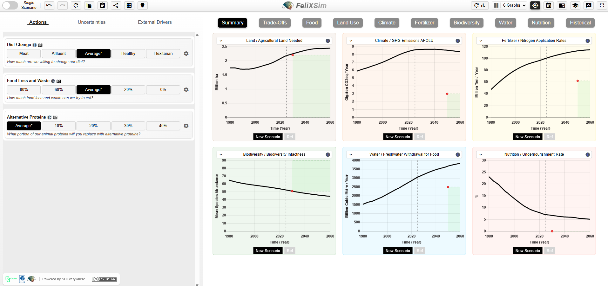

# Issue 2 - Summer 2026

Welcome to the FeliX Modeling Community Newsletter! This biannual update is designed to keep partners, collaborators, and users informed about the latest news and developments related to the FeliX model, as well as recent publications and opportunities to engage with the community. As the model continues to evolve, our goal is to increase transparency, share methodological progress, and support the growing network of researchers and stakeholders who are applying FeliX to various fields.

[FeliX is a system dynamics model](https://iiasa.ac.at/models-tools-data/felix) of the interactions between the global climate, economy, environment, and society, hosted at the International Institute for Applied Systems Analysis (IIASA). The model is [publicly available](https://github.com/iiasa/Felix-Model) and supported by this online documentation.

## Latest Publications

- Liu, Q., Guo, Z., Guo, M., et al. (2026). Assessing the dynamic evolution of global energy poverty under uncertain climate trends–shaped future pathways. *Sustainable Development*, **34**(S2): 1203–1220.

- Tantaroudas, N.D., Tan, R.Y.W., Karachalios, I., et al. (2026). [A web-based interactive simulation environment for the FeliX Integrated Assessment Model](https://open-research-europe.ec.europa.eu/articles/6-89). *Open Research Europe*, **6**: 89.

- Eker, S, Reiter, C, Liu, Q., et al. (2026) [Wellbeing cost of carbon](https://doi.org/10.1017/sus.2025.10042). *Global Sustainability*, **9**, e1.

- Yu, L., Wu, X., Sang, S., et al. (2026) [Yellow River Basin water stress has eased but may persist without enhanced efficiency and sustainable agriculture](https://doi.org/10.1038/s44458-025-00005-7). *Communications Sustainability*, **1**, 9.

**See [all publication](3_publication.md)**.

## Recent Model updates
### Lifestyle Module and Sectorial Energy Demand
The [FeliX lifestyle module](https://github.com/iiasa/Felix-Model/tree/master/Previous_and_Branched_Versions/2026_FeliX%20v27%20lifestyle) brings endogenously driven lifestyle change into the model by treating lifestyles as interactions between behaviour, cognition, and context. It represents four lifestyle groups - Resourceful, Active, Cautious and Constrained - and tracks how their population shares and behaviours evolve over time. Changes in behaviour, organized through the Avoid-Shift-Improve typology, are then translated into impacts on residential energy, passenger transport energy and food demand.

In addition to the lifestyle module, this new release includes disaggregation of the energy demand to end use sectors (buildings, transport, industrial) based on activity levels. Documentation will be released in the coming weeks.

Learn more about [Lifestyle Module and Sectorial Energy Demand](https://github.com/iiasa/Felix-Model/tree/master/Previous_and_Branched_Versions/2026_FeliX%20v27%20lifestyle) in FeliX.

### FeliX-China&ROW
Sichuan University’s FeliX team is developing FeliX-China&ROW (A China–Rest of World Integrated Model), a China-adapted version of FeliX designed to analyze the co-evolution and interaction between China and the rest of the world under alternative “Dual Carbon” transition pathways. The model assesses how different carbon neutrality pathways shape global sustainability dynamics and seeks coordinated strategies that jointly advance China’s carbon goals and global sustainable development.
 
Sichuan team is also developing FeliX-Tech, an extended FeliX modeling framework that explicitly integrates technological dynamics and feedback mechanisms into global sustainability assessments. The model explores how technological transformation interacts with key socio-economic and environmental systems at both China and global scales.
 
Stay tuned for these upcoming updates.

### FeliXSim
FeliXSim is an Interactive Simulation Environment that makes the system dynamics IAM FeliX accessible to non-experts. The tool focuses on behavioral change in the food system, allowing users to explore how dietary shifts and reduced food waste scale into system-wide environmental impacts. We demonstrate how such interactive tools can support more inclusive and participatory scenario development. Other unique features of FeliXSim are an interactive lesson and a survey where users can enter their own dietary habits and see their global implications.

|
|:--|

Learn more about [FeliXSim](https://climatechoice.github.io/felix/)

## News from the FeliX community

- From 14 to 18 June, Ryan Tan and Quanliang Ye represented the FeliX team and participated in the **World Biodiversity Forum** in Davos, Switzerland. Ryan presented the team's work on [analysing feedback uncertainties in modelling food systems](https://meetingorganizer.copernicus.org/WBF2026/WBF2026-446.html) (using FeliX), demonstrating how a systems approach can address model biases that are often shaped by sector-specific priorities and assumptions. He also participated in a full-day workshop on potential next steps to improving biodiversity representation in integrated assessment and (inter)sectoral models.

- David Leoncio Hehl represented the FeliX team at the **EGU General Assembly** in Vienna presenting two studies on social tipping dynamics. The work examined how [societal feedbacks can reshape financial pathways for decarbonization](https://meetingorganizer.copernicus.org/EGU26/EGU26-20365.html) and how [battery storage can enable self-reinforcing transitions towards renewable energy systems](https://meetingorganizer.copernicus.org/EGU26/EGU26-20651.html).

- The FeliX team contributed to a [**CHOICE webinar**](https://www.climatechoice.eu/2026/03/26/choice-webinar-explores-interactive-tools-for-climate-conscious-food-system-transformation/) on interactive tools for climate-conscious food system transformation. The webinar showcased how FeliXSim can be used to explore pathways to a sustainable food system and low-carbon behaviour change.

- FeliX is participating in the [Reduced Complexity Modelling Intercomparison Project Phase 3](https://egusphere.copernicus.org/preprints/2025/egusphere-2025-5775/) with the goal of contributing datasets to strengthen climate projections.

## Upcoming
- The FeliX team will deliver the workshop [*Low-Carbon Behavior Changes: Exploring Food System Scenarios With FeliXSim*](https://systemdynamics.org/conference/workshops/), at the **International System Dynamics Conference**, on 24th of July introducing participants to the [FeliXSim](https://climatechoice.github.io/felix/) platform and its use for exploring dietary transitions and sustainable food system pathways. If you are attending the conference, we would be delighted to see you there and discuss our latest work.

- We will further present at two upcoming webinars of the WorldTrans project. Please join if you would like to hear more about our work.

    - Deepthi Swamy on modeling lifestyles and David Leoncio on society-finance relations **9 September 2026** - [Access here](https://us04web.zoom.us/j/79502437327?pwd=WRHQtJUJ97jGOrMldrKGQfoTDTh3tG.1&jst=2#success)
    - Sibel Eker on segmentation levels in modeling human behavior in climate policy context **21 October 2026** - [Access here](https://us04web.zoom.us/j/79502437327?pwd=WRHQtJUJ97jGOrMldrKGQfoTDTh3tG.1&jst=2#success)

- The FeliX team will be presenting at the [**IAMC Conference in Athens**](https://www.iamconsortium.org/19th-annual-meeting-2026/) this November. We look forward to sharing our latest research and connecting with colleagues, meet us there.

## About Us
FeliX is supported by a [collaborative team of modelers and researchers at IIASA](https://iiasa.ac.at/models-tools-data/felix) who specialize in energy systems, land use, climate policy, behavioral dynamics, and Earth system feedback. The group leads ongoing model development, calibration, application, and community engagement.

## Questions and next issue
We are always available to answer any questions you may have.

Please reach us also for the news you’d like to have included in the next issue.

Our mailing address is: felixmodel@iiasa.ac.at. Click [here](mailto:felixmodel@iiasa.ac.at?subject=FeliX%20Newsletter&body=) to send us an email!

*Copyright (C) 2025 International Institute of Applied Systems Analysis. All rights reserved. [Terms and conditions](https://iiasa.ac.at/sites/default/files/2026-02/IIASA%20FeliX%20Newsletter%20-%20Data%20Protection%20Information%20and%20Consent%20Declaration.pdf)* 