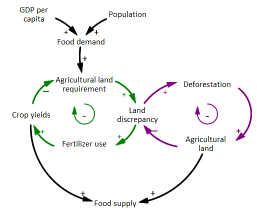
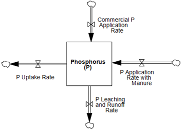

# 5. Land use and fertilizer use
FeliX represents the global land use and land use change dynamics based on four main categories of land use as defined by FAO (FAOSTAT, 2020): agricultural, forest, urban/industrial, and the other land that does not fall into any of the first three categories. Land use change refers to the conversion of land among these four categories. Considering the historical and expected dynamics, we assume a bi-directional conversion between the agricultural land and forest land and between the agricultural land and other land. The rest of land use changes are considered one directional conversion, that is, from agricultural land to urban and industrial land, from forest land to urban and industrial land, and from other land to forest land (Figure 5.1).

|
|:--|
|Figure 5.1. Stylized stock-flow diagram of land use module in FeliX.|

## 5.1 Land conversion
The main underlying driver of land use change is the food system, in addition to bioenergy and forest management practices (Figure 5.1). Each land category is modeled as a stock. Apart from urban and industrial land, which is set to increase only, all other types of land can gain more space or lose it due to land conversion. For instance, abandoning any human activities in a part of agriculture land and allowing certain duration of time the agriculture land will be covered by grass, later by shrubs, yet later by trees and eventually it will be classified as forest. The easier it is for the natural process to transform the area the transformation time is set to a lower value. In case of forest‒agriculture land conversion, agriculture‒other land conversion, and other‒forest land conversion, there are additional forces apart from natural conversion processes that drive and increase the rate of expansion or shrinking of the forest, other and agriculture land areas. We set a constant ratio of other land and forest land areas as protected land. In case of forest land, the protected area increases successively. The protected areas are excluded from any transformation processes. The agricultural land requirements and its estimates will be especially elaborated in the next section due to the key link with diet change module (Figure 3 in [Introduction](0_introduction.md)).

## 5.2 Agricultural land requirements

|
|:--|
|Figure 5.2. Stylized stock-flow diagram of land use module in FeliX.|

Agricultural land requirement increases due to the growing population and income levels which lead to more food demand (Figure 5.2). In Felix, agricultural land is further divided into three sub-categories as arable land, permanent cropland, and permanent meadows and pastures. Land use shifts due to food demand are considered based on plant- and animal-based food that have their own land allocation and yields. FeliX totally specifies eight categories of food products and sorts them into plant-based and animal-based food:
- Plant-based food: pulses, grains, vegetables and fruits, and other crops such as sugar and oil crops
- Animal-based food: pasture-based meat, crop-based meat, dairy, and eggs

This categorization of especially animal products were motivated by the land use shares. That is, the pasture-based meat category includes the red meat sources such as beef, sheep and goat, since 96% of the global average land use per unit of beef production is attributed to pasture land, that is, 12 of 12.5 ha per million kcal (Ranganathan et al., 2016). As for poultry and pork, the average land use footprint is less than 2 ha, while a large portion of this is on cropland (Ranganathan et al., 2016), since grains provide the 71% of the total feed demand (FAOSTAT, 2020).

For each plant-based food, the arable land needed ($$ALN_{food}$$) is formulated according to the desired production rate ($$Pord\_Des$$) and the expected crop yield ($$Yield\_Exp$$), which is a 1-year time-averaged value of the crop yield over time.

$$
ALN_{food}(t) = 
\frac
    {Prod\_Des_{food}(t)}
    {Yield\_Exp_{food}(t)}
, \text{where } food \in [pulses,\ grains,\ vegetables\ and\ fruits,\ other\ crops ]
$$

(Eq. 5.1)

$$Prod\_Des_{food}$$ of each plant crop is the sum of the demand for that crop to be used as food, livestock feed, and in other sectors. The estimate procedures of crops to be used as food and livestock feed are described in the section **6 Diet Change**. Crop to be used in other sectors is quantified as a constant ratio of total plant-based food demand. The actual production of each plant crop is the lower value of $$Prod\_Des_{food}$$ and the production volume calculated as crop yield ($$Yield_{food}$$) multiplied by the area harvested ($$Area\_Harv_{food}$$).

$$
Prod_{food}(t) = 
MIN \Big(Prod\_Des_{food}(t),Yield_{food}(t) \times Area\_Harv_{food}(t)\Big)
, \text{where } food \in [pulses,\ grains,\ vegetables\ and\ fruits,\ other\ crops ]
$$

(Eq. 5.2)

$$Yield_{food}$$ is formulated with respect to a reference yield values in 2016 ($$Yield\_2016_{food}$$) with the dynamic multiplicative impact of fertilizer application ($$Imp\_Fertz\_on\_Yield$$), water withdrawal rate ($$Imp\_Wat\_on\_Yield$$) and technology change ($$Imp\_Tech\_on\_Yield$$).

$$
Yield_{food}(t) = 
    Yield\_2016_{food}(t) \times 
    Imp\_Fertz\_on\_Yield(t) \times
    Imp\_Wat\_on\_Yield(t) \times
    Imp\_Tech\_on\_Yield(t)
$$

(Eq. 5.3)

$$Imp\_Tech\_on\_Yield$$ is formulated as a logistic function of $$GDP\_per\_Cap$$, representing the agricultural technology development as economic prosperity increases.

$$
Imp\_Tech\_on\_Yield(t) = 
    L\_Yield -
    e^{
        k\_Yield \times 
        \frac
            {GWP\_per\_Cap(t)}
            {GWP\_per\_Cap\_2000}
    }

$$

(Eq. 5.4)

The effect water availability is represented by the agricultural water withdrawal rate (see **4.2. Water demand, water withdrawal, and water use**). As for the effect of fertilizer use, nitrogen and phosphorus fertilizer use in agriculture, from commercial sources or livestock manure, is explicitly modeled in FeliX. Potash fertilizer is not included in the model due to its small fraction in global fertilizer use (∼20%), and its much lower environmental impacts compared with nitrogen and phosphorus. Both nitrogen and phosphorus use, as well as their impacts, are modeled in a similar framework that focuses on chemical inflows to and outflows from agricultural land that is summarized in **5.3 Fertilizer use** only for phosphorus.

$$Area\_Harv_{food}$$ in Eq. 5.2 is a fraction of the total available arable land ($$AL$$), where this fraction is determined by the arable land needed for each crop ($$ALN_{food}$$).

$$
Area\_Harv_{food}(t) = AL(t) \times 
    \frac
        {ALN_{food}(t)}
        {\sum_{food}{ALN_{food}(t)}}

, \text{where } food \in [\text{pulses, grains, vegetables and fruits, other crops} ]
$$

(Eq. 5.5)

The total agricultural land requirements are estimated by dividing total $$ALN$$ by the annual share of arable land in the total agricultural land. The rest of agricultural land is proportionally distributed as permanent cropland and permanent meadows and pastures according to their annual share in agricultural land.

The discrepancy between agricultural land requirement and available agricultural land pushes agricultural production systems either towards more fertilizer use to increase the crop yields and reduce the land requirement, or to deforestation and other land requisition to expand the agricultural land. Eventually, food supply is dependent on the land available, hence harvested, for each food category, and the crop (or meat) yields that depend on fertilizer use, water availability and other agricultural management practices.

## 5.3 Fertilizer use
Nitrogen and phosphorus fertilizer use in agriculture, from commercial sources or livestock manure, is explicitly modeled in FeliX. Both nitrogen and phosphorus use, as well as their impacts, are modeled in a similar framework that focuses on chemical inflows to and outflows from agricultural land. This section uses phosphorus ($$P$$) use as an example to explain the framework.

|
|:--|
|Figure 5.3. Agricultural phosphorus inflows and outflows considered in FeliX.|

Global $$P$$ balance with major inflows and outflows (Figure 5.3) is based on an input and output framework (MacDonald et al., 2011) and a former modeling study about the biochemical processes of phosphorus (Dumas et al., 2011). In general, the global $$P$$ residual in soil grows due to the application of commercial $$P$$ fertilizers and the application of manure as a fertilizer, and decreases due to the uptake by crops and the loss of $$P$$ via erosion, leaching to freshwater systems and surface runoff. The residual $$P$$ and flows are reported in terms of the volume of elemental $$P$$, except the commercial fertilizer production and application, which are reported as the volume of $$P_2O_5$$ content. The application of commercial $$P$$ fertilizers ($$P\_Comm$$) is modeled as the minimum of $$P$$ demand from agriculture ($$P\_Dem$$) and $$P$$ supply for agriculture ($$P\_Sup$$).

$$
P\_Comm(t) = MIN \Big( P\_Dem(t), P\_Sup(t) \Big)
$$

(Eq. 5.6)

$$P\_Dem$$ from agriculture is formulated based on a reference application rate ($$P\_Comm\_Ref$$), taking into account the effect of income levels ($$Imp\_GWP\_on\_P$$) and land scarcity ($$Imp\_Land\_on\_P$$).

$$
P\_Dem(t) = P\_Comm\_Ref \times Imp\_GWP\_on\_P(t) \times Imp\_Land\_on\_P(t)
$$

(Eq. 5.7)

Both effects are formulated as logistic functions based on $$GWP\_per_Cap$$ (Eq. 5.8) and the ratio between global agricultural land demand ($$Land\_Dem\_Agri$$) and the available agricultural land ($$Land\_Agri$$, Eq. 5.9), respectively. 

$$
Imp\_GWP\_on\_P(t) = 
    \frac
        {L\_GWP\_P}
        {1+e^{
            -k\_GWP\_P \times (
                \frac
                    {GWP\_per\_Cap(t)}
                    {GWP\_per\_Cap\_2000}
            - x0\_GWP\_P
            )
        }
        }
$$

(Eq. 5.8)

$$
Imp\_Land\_on\_P(t) = 
    \frac
        {L\_Land\_P}
        {1+e^{
            -k\_Land\_P \times (
                \frac
                    {Land\_Dem\_Agri(t)}
                    {Land\_Agri(t)}
            - x0\_Land\_P
            )
        }
        }
$$

(Eq. 5.9)

Parameters used in Eqs. 5.8 and 5.9 are quantified via calibration. Supply for agriculture is a fraction of the total $$P$$ via $$P$$ rock extraction. This fraction is set as 0.9, since the agricultural use has been on average 90% of the total $$P_2O_5$$ produced between 2002 and 2015 (FAO, 2018). $$P$$ uptake by crops are estimated as a weighted average of the $$P$$ contents in individual food category, using the data from USDA Food Composition Databases (USDA, 2020). We assume a nonlinear relation between $$P$$ uptake and crop yields, based on the agronomic nonlinear dynamics of crop growth (Yin and Struik, 2010) that result in sigmoid growth. 

## References
- Dumas, M., Frossard, E., Scholz, R.W., 2011. Modeling biogeochemical processes of phosphorus for global food supply. Chemosphere 84, 798–805. https://doi.org/10.1016/j.chemosphere.2011.02.039
- FAO, 2018. Nutrient Phosphate P2O5 Fertilizers by Nutrient.
- FAOSTAT, 2020. Food Balance Sheets.
- MacDonald, G.K., Bennett, E.M., Potter, P.A., Ramankutty, N., 2011. Agronomic phosphorus imbalances across the world’s croplands. Proc. Natl. Acad. Sci. U.S.A. 108, 3086–3091. https://doi.org/10.1073/pnas.1010808108
- Ranganathan, J., Vennard, D., Waite, R., Lipinski, B., Searchinger, T., Dumas, P., 2016. Shifting Diets for a Sustainable Food Future: Creating a Sustainable Food Future, Installment Eleven.
- USDA, 2020. USDA Food Composition Databases.
- Yin, X., Struik, P.C., 2010. Modelling the crop: from system dynamics to systems biology. Journal of Experimental Botany 61, 2171–2183. https://doi.org/10.1093/jxb/erp375

