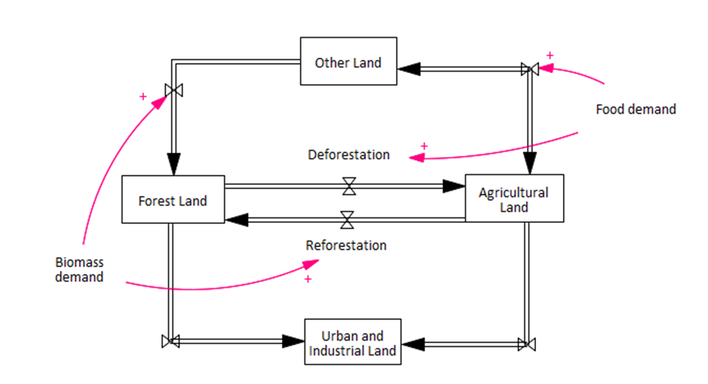

# 5. Land use and fertilizer use
FeliX represents the global land use and land use change dynamics based on four main categories of land use as defined by FAO (FAOSTAT, 2020a): agricultural, forest, urban/industrial, and the other land that does not fall into any of the first three categories. Land use change refers to the conversion of land among these four categories. Considering the historical and expected dynamics, we assume a bi-directional conversion between the agricultural land and forest land and between the agricultural land and other land. The rest of land use changes are considered one directional conversion, that is, from agricultural land to urban and industrial land, from forest land to urban and industrial land, and from other land to forest land (Figure 5.1).

|
|:--|
|Figure 5.1. Stylized stock-flow diagram of land use module in FeliX.|

## 5.1 Land conversion